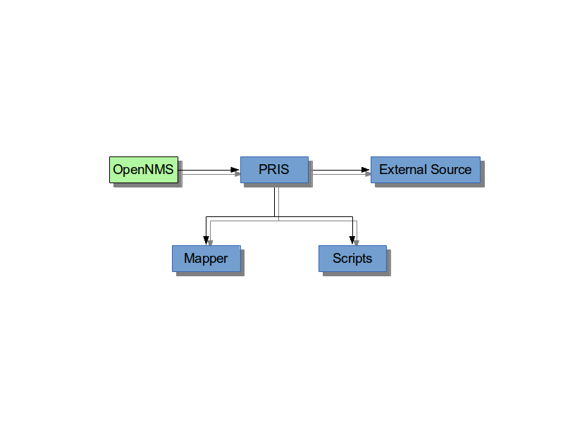

= Documentation Overview

[[community-docs]]
== Writing OpenNMS Documentation

NOTE: Other than writing documentation, you can help out by providing comments about improvements or reporting bugs - head over to the http://issues.opennms.org/browse/NMS/component/10011[issue tracker for documentation] to do that!

For how to build the manual see:
https://github.com/OpenNMS/opennms/blob/development/docs/opennms-doc/doc-overview/README.adoc[readme]

The documents use the AsciiDoc format, see:

* http://www.methods.co.nz/asciidoc/[Aciidoc Reference]
* http://www.methods.co.nz/asciidoc/faq.html[AsciiDoc FAQ]
* http://powerman.name/doc/asciidoc[AsciiDoc cheatsheet]
* http://xpt.sourceforge.net/techdocs/nix/tool/asciidoc-syn/ascs01-AsciiDocMarkupSyntaxQuickSummary/single/[AsciiDoc Cheatsheet]

Here you can find other resources to get familiar with AsciiDoc, see:

 * http://asciidoctor.org/docs/user-manual[AsciiDoc User Manual]
 * http://asciidoctor.org/docs/install-and-use-asciidoctor-maven-plugin/[AsciiDoc Maven Plugin]
 * https://groups.google.com/forum/?fromgroups#!forum/asciidoc[AsciiDoc discussion list]
 * http://code.google.com/p/asciidoc/issues/list[AsciiDoc issue tracker]
 * https://github.com/oreillymedia/docbook2asciidoc[Docbook to AsciiDoc]
 * http://blog.rainwebs.net/2010/02/25/how-to-create-handsome-pdf-documents-without-frustration/[How to create handsome PDF documents without frustration]

The cheatsheets are really useful!

[[community-docs-overall-flow]]
== Overall Flow ==

Each (sub)project represents a part of the documentation, which will produce a HTML output in the file system.
The output is generated in the `target/generated` sources folder.
Asciidoc documents have the +.asciidoc+ file extension.

Note that different ways to add documentation works best for different cases:

* Tutorials and How To's should be published on the http://wiki.opennms.org[OpenNMS Wiki].
For example you want to describe how to use the Net-SNMP agent and the SNMP monitor from OpenNMS to solve a special use case with OpenNMS.

* The documentation you can find in the source code can be characterized as a non-emotional technical documentation which explains concepts in detail and should be complete.

== File Structure in 'opennms-doc' ==

[options="header", cols="e,d"]
|========================
| Directory | Contents
| doc-overview/ | module with this overview documentation
| guide-user/ | module with the guide for people how to use and configure OpenNMS
| guide-admin/ | module with the guide for administrators optimizing and running OpenNMS
| guide-development/ | module with the guide for people who want to develop within OpenNMS
| guide-install/ | module with the guide how to install OpenNMS on different operating systems
| releasenotes/ | module with the changelog and release notes
|========================

== Headings and document structure ==

Each document starts over with headings from level zero (the document title).
Each document should have an id.
In some cases sections in the document need to have id's as well, this depends on where they fit in the overall structure.
To be able to link to content, it has to have an id. Missing id's in mandatory places will fail the build.

This is how a document should start:

[source]
----
[[unique-id-verbose-is-ok]]
= The Document Title =
----

To push the headings down to the right level in the output, the +leveloffset+
attribute is used when including the document inside of another document.

Subsequent headings in a document should use the following syntax:

[source]
----
== Subheading ==

... content here ...

=== Subsubheading ===

content here ...

----

== Writing ==

Put one sentence on each line.
This makes it easy to move content around, and also easy to spot (too) long sentences.

== Gotchas ==

* Always leave a blank line at the end of documents
  (or the title of the next document might end up in the last
  paragraph of the document)
* As +{}+ are used for Asciidoc attributes, everything inside will be treated as an attribute.
  What you have to do is to escape the opening brace: +\\{+.
  If you don't, the braces and the text inside them will be removed without any warning being issued!

== Links ==

To link to other parts of the manual the id of the target is used.
This is how such a reference looks:

[source]
----
<<community-docs-overall-flow>>
----

Which will render like: <<community-docs-overall-flow>>

[NOTE]
Just write "see \<<target-id>>" and similar, that should suffice in most cases.

If you need to link to another document with your own link text, this is what to do:

[source]
----
<<target-id, link text that fits in the context>>
----

NOTE: Having lots of linked text may work well in a web context but is a pain in print, and we aim for both!

External links are added like this:

[source]
----
http://www.opennms.org/[Link text here]
----

Which renders like: http://www.opennms.org/[Link text here]

For short links it may be better not to add a link text, just do:

[source]
----
http://www.opennms.org/
----

Which renders like: http://www.opennms.org/

NOTE: It's ok to have a dot right after the URL, it won't be part of the link.

== Text Formatting ==

* \_Italics_ is rendered as _Italics_ and used for emphasis.
* \*Bold* is rendered as *Bold* and used sparingly, for strong emphasis only.
* \+methodName()+ is rendered as +methodName()+ and is used for literals as well
  (note: the content between the `+` signs _will_ be parsed).
* \`command` is rendered as `command` (typically used for command-line)
  (note: the content between the +`+ signs _will not_ be parsed).
* Mono\+\+space\++d is rendered as Mono++space++d and is used for monospaced letters.
* \'my/path/' is rendered as 'my/path/' (used for file names and paths).
* \\``Double quoted'' (that is two grave accents to the left and two acute accents to the right) renders as ``Double quoted''.
* \`Single quoted' (that is a single grave accent to the left and a single acute accent to the right) renders as `Single quoted'.

== Admonitions ==

These are very useful and should be used where appropriate.
Choose from the following (write all caps and no, we can't easily add new ones):

NOTE: Note.

TIP: Tip.

IMPORTANT: Important

CAUTION: Caution

WARNING: Warning

Here's how it's done:

[source]
----
NOTE: Note.
----

A multiline variation:

[source]
----
[TIP]
Tiptext.
Line 2.
----

Which is rendered as:

[TIP]
Tiptext.
Line 2.

== Images ==

IMPORTANT: _All images in the entire manual share the same namespace._
  You know how to handle that.

=== Images Files ===

To include an image file, make sure it resides in the 'images/' directory relative to the document you're including it from. Then go:

[source]
----
image::images/opennms-logo.png[]
----

Which is rendered as:

image::images/opennms-logo.png[]

=== Static Graphviz/DOT ===

We use the Graphviz/DOT language to describe graphs.
For documentation see http://graphviz.org/.

This is how to include a simple example graph:

The optional second argument given to the dot filter defines the style to use:

* when not defined: Default styling for nodespace examples.
* +neoviz+: Nodespace view generated by Neoviz.
* +meta+: Graphs that don't resemble db contents, but rather concepts.

CAUTION: Keywords of the DOT language have to be surrounded by double quotes when used for other purposes.
  The keywords include _node, edge, graph, digraph, subgraph,_ and _strict_.

== Attributes ==

Common attributes you can use in documents:

* \{opennms-version} - rendered as "{opennms-version}"

These can substitute part of URLs that point to for example APIdocs or source code.
Note that opennms-git-tag also handles the case of snapshot/master.

Sample Asciidoc attributes which can be used:

* \{docdir} - root directory of the documents
* \{nbsp} - non-breaking space

== Comments ==

There's a separate build including comments.
The comments show up with a yellow background.
This build doesn't run by default, but after a normal build, you can use `make annotated` to build it.
You can also use the resulting page to search for content, as the full manual is on a single page.

Here's how to write a comment:

[source]
----
// this is a comment
----

The comments are not visible in the normal build.
Comment blocks won't be included in the output of any build at all.
Here's a comment block:

[source]
----
////
Note that includes in here will still be processed, but not make it into the output.
That is, missing includes here will still break the build!
////
----

== Code Snippets ==

=== Explicitly defined in the document ===

WARNING: Use this kind of code snippets as little as possible.
  They are well known to get out of sync with reality after a while.

This is how to do it:

[source,xml]
----
<service name="DNS" interval="300000" user-defined="false" status="on">
  <parameter key="retry" value="2" />
  <parameter key="timeout" value="5000" />
  <parameter key="port" value="53" />
  <parameter key="lookup" value="localhost" />
  <parameter key="fatal-response-codes" value="2,3,5" /><!-- ServFail, NXDomain, Refused -->
  <parameter key="rrd-repository" value="/opt/opennms/share/rrd/response" />
  <parameter key="rrd-base-name" value="dns" />
  <parameter key="ds-name" value="dns" />
</service>
----

If there's no suitable syntax highlighter, just omit the language: +[source]+.

Currently the following syntax highlighters are enabled:

* Bash
* Groovy
* Java
* JavaScript
* Python
* XML

For other highlighters we could add see https://code.google.com/p/google-code-prettify/.

=== Fetched from source code ===

Code can be automatically fetched from source files.
You need to define:

* component: the +artifactId+ of the Maven coordinates,
* source: path to the file inside the jar it's deployed to,
* classifier: +sources+ or +test-sources+ or any other classifier pointing to the artifact,
* tag: tag name to search the file for,
* the language of the code, if a corresponding syntax highlighter is available.

Note that the artifact has to be included as a Maven dependency of the Manual project so that the files can be found.

The file will be searched for lines including +START SNIPPET: {tag}+ and +END SNIPPET: {tag}+, the lines between those will go into the output.
Be aware of that the tag "abc" will match "abcd" as well.
It's a simple on/off switch, meaning that multiple occurrences will be assembled into a single code snippet in the output.
This behavior can be user to hide away assertions from code examples sourced from tests.

This is how to define a code snippet inclusion:

[source]
----
 [snippet,java]
 ----
 component=opennms-examples
 source=org/opennms/examples/JmxDocTest.java
 classifier=test-sources
 tag=getStartTime
 ----
----

This is how it renders:

[snippet,java]
----
component=opennms-examples
source=org/opennms/examples/JmxDocTest.java
classifier=test-sources
tag=getStartTime
----

=== Query Results ===

There's a special filter for Cypher query results.
This is how to tag a query result:

[source]
----
 .Result
 [queryresult]
 ----
 +----------------------------------+
 | friend_of_friend.name | count(*) |
 +----------------------------------+
 | Ian                   | 2        |
 | Derrick               | 1        |
 | Jill                  | 1        |
 +----------------------------------+
 3 rows, 12 ms
 ----
----

This is how it renders:

.Result
[queryresult]
----
+----------------------------------+
| friend_of_friend.name | count(*) |
+----------------------------------+
| Ian                   | 2        |
| Derrick               | 1        |
| Jill                  | 1        |
+----------------------------------+
3 rows, 12 ms
----

== Images

.pris-overview.graphml
image::images/pris-overview.png[pris-overview.graphml]

.example.odp

