// Allow GitHub image rendering
:imagesdir: ../images

[opennms-provisioning]
== OpenNMS Provisioning

[provisioning]
=== Provisioning

==== Summary

The introduction of OpenNMS version 1.8 empowers enterprises and services providers like never before with a new service daemon for maintaining the managed entity inventory in OpenNMS.
This new daemon, _Provisiond_, unifies all previous entity control mechanisms available in 1.6 (_Capsd_ and the _Importer_), into a new and improved, massively parallel, policy based provisioning system.
System integrators should note, _Provisiond_ comes complete with a _RESTFul Web Service API_ for easy integration with external systems such as CRM or external inventory systems as well as an adapter API for interfacing with other management systems such as configuration management.

OpenNMS 1.0, introduced almost a decade ago now, provided a capabilities scanning daemon, Capsd, as the mechanism for provisioning managed entities.
_Capsd_, deprecated with the release of 1.8.0, provided a rich automatic provisioning mechanism that simply required an IP address to seed its algorithm for creating and maintaining the managed entities (nodes, interfaces, and IP based services).
Version 1.2 added and _XML-RPC API_ as a more controlled (directed) strategy for provisioning services that was mainly used by non telco based service providers (i.e. managed hosting companies).
Version 1.6 followed this up with yet another and more advanced mechanism called the _Importer service daemon_.
The _Importer_ provided large service providers with the ability to strictly control the OpenNMS entity provisioning with an XML based API for completely defining and controlling the entities where no discovery and service scanning scanning was feasible.

The Importer service improved OpenNMS' scalability for maintaining managed entity databases by an order of magnitude.
This daemon, while very simple in concept and yet extremely powerful and flexible provisioning improvement, has blazed the trail for Provisiond.
The Importer service has been in production for 3 years in service provider networks maintaining entity counts of more than 50,000 node level entities on a single instances of OpenNMS.
It is a rock solid provisioning tool.

_Provisiond_ begins a new era of managed entity provisioning in OpenNMS.

==== Concepts

_Provisioning_ is a term that is familiar to service providers (a.k.a. operators, a.k.a. telephone companies) and OSS systems but not so much in the non OSS enterprises.

Provisiond receives "requests" for adding managed entities via 2 basic mechanisms, the OpenNMS traditional "New Suspect" event, typically via the _Discovery daemon_, and the import requisition (XML definition of node entities) typically via the Provisioning Groups UI.
If you are familiar with all previous releases of OpenNMS, you will recognize the _New Suspect Event_ based _Discovery_ to be what was previously the _Capsd_ component of the auto discovery behavior.
You will also recognize the import requisition to be of the _Model Importer_ component of OpenNMS.
_Provisiond_ now unifies these two separate components into a massively parallel advanced policy based provisioning service.

===== OpenNMS Provisioning Terminology

The following terms are used with respect to OpenNMS’ provisioning system and are essential for understanding the material presented in this guide.

====== Entity

Entities are managed objects in OpenNMS such as Nodes, IP interfaces, SNMP Interfaces, and Services.

====== Foreign Source and Foreign ID

The _Importer_ service from 1.6 introduced the idea of foreign sources and foreign IDs.
The _Foreign Source_ uniquely identifies a provisioning source and is still a basic attribute of importing node entities into OpenNMS.
The concept is to provide an external (foreign) system with a way to uniquely identify itself and any node entities that it is requesting (via a requisition) to be provisioned into OpenNMS.

The _Foreign ID_ is the unique node ID maintained in foreign system and the foreign source uniquely identifies the external system in OpenNMS.

OpenNMS uses the combination of the foreign source and foreign ID become the unique foreign key when synchronizing the set of nodes from each source with the nodes in the OpenNMS DB.
This way the foreign system doesn’t have to keep track of the OpenNMS node IDs that are assigned when a node is first created.
This is how _Provisiond_ can decided if a node entity from an import requisition is new, has been changed, or needs to be deleted.

====== Foreign Source Definition

Additionally, the foreign source has been extended to also contain specifications for how entities should be discovered and managed on the nodes from each foreign source.
The name of the foreign source has become pervasive within the provisioning system and is used to simply some of the complexities by weaving this name into:

* the name of the provisioning group in the Web-UI
* the name of the file containing the persisted requisition (as well as the pending requisition if it is in this state)
* the foreign-source attribute value inside the requisition (obviously, but, this is pointed out to indicate that the file name doesn’t necessarily have to equal the value of this attribute but is highly recommended as an OpenNMS best practice)
* the building attribute of the node defined in the requisition (this value is called “site” in the Web-UI and is assigned to the building column of the node’s asset record by Provisiond and is the default value used in the Site Status View feature)

====== Import Requisition

Import requisition is the terminology OpenNMS uses to represent the set of nodes, specified in XML, to be provisioned from a foreign source into OpenNMS.
The requisition schema (XSD) can be found at the following location. http://xmlns.opennms.org/xsd/config/model-import[http://xmlns.opennms.org/xsd/config/model-import]

====== Auto Discovery

Auto discovery is the term used by OpenNMS to characterize the automatic provisioning of nodes entities.
Currently, OpenNMS uses an ICMP ping sweep to find IP address on the network.
For the IPs that respond and that are not currently in the DB, OpenNMS generates a new suspect event.
When this event is received by Provisiond, it creates a node and it begins a node scan based on the default foreign source definition.

====== Directed Discovery

Provisiond takes over for the Model Importer found in version 1.6 which implemented a unique, first of its kind, controlled mechanism for specifying managed entities directly into OpenNMS from one or more data sources.
These data sources often were in the form of an in-housed developed inventory or stand-alone provisioning system or even a set of element management systems.
Using this mechanism, OpenNMS is directed to add, update, or delete a node entity exactly as defined by the external source.
No discovery process is used for finding more interfaces or services.

====== Enhanced Directed Discovery

Directed discovery is enhanced with the capability to scan nodes that have been directed nodes for entities (interfaces.

====== Policy Based Discovery

The phrase, Policy based Directed Discovery, is a term that represents the latest step in OpenNMS’ provisioning evolution and best describes the new provisioning architecture now in OpenNMS for maintaining its inventory of managed entities.
This term describes the control that is given over the Provisioning system to OpenNMS users for managing the behavior of the NMS with respect to the new entities that are being discovered.
Current behaviors include persistence, data collection, service monitoring, and categorization policies.

===== Addressing Scalability

The explosive growth and density of the IT systems being deployed today to support not traditional IP services is impacting management systems like never before and is demanding from them tremendous amounts of scalability.
The scalability of a management system is defined by its capacity for maintaining large numbers of managing entities coupled with its efficiency of managing the entities.

Today, It is not uncommon for OpenNMS deployments to find node entities with tens of thousands of physical interfaces being reported by SNMP agents due to virtualization (virtual hosts, interfaces, as well as networks).
An NMS must be capable of using the full capacity every resource of its computing platform (hardware and OS) as effectively as possible in order to manage these environments.
The days of writing scripts or single threaded applications will just no longer be able to do the work required an NMS when dealing with the scalability challenges facing systems and systems administrators working in this domain.

====== Parallelization and Non-Blocking I/O

Squeezing out every ounce of power from a management system’s platform (hardware and OS) is absolutely required to complete all the work of a fully functional NMS such as OpenNMS.
Fortunately, the hardware and CPU architecture of a modern computing platform provides multiple CPUs with multiple cores having instruction sets that include support for atomic operations.
While these very powerful resources are being provided by commodity systems, it makes the complexity of developing applications to use them vs. not using them, orders of magnitude more complex.
However, because of scalability demands of our complex IT environments, multi-threaded NMS applications are now essential and this has fully exposed the complex issues of concurrency in software development.

OpenNMS has stepped up to this challenge with its new concurrency strategy.
This strategy is based on a technique that combines the efficiency of parallel (asynchronous) operations (traditionally used by most effectively by single threaded applications) with the power of a fully current, non-blocking, multi-threaded design.
The non-blocking component of this new concurrency strategy added greater complexity but OpenNMS gained orders of magnitude in increased scalability.

NOTE: Java Runtimes, based on the Sun JVM, have provided implementations for processor based atomic operations and is the basis for OpenNMS’ non-blocking concurrency algorithms.

====== Provisioning Policies

Just because you can, doesn’t mean you should!
Because the massively parallel operations being created for _Provisiond_ allows tremendous numbers of nodes, interfaces, and services to be very rapidly discovered and persisted, doesn’t mean it should.
A _policy API_ was created for _Provisiond_ that allows implementations to be developed that can be applied to control the behavior of _Provisiond_.
The 1.8 release includes a set of flexible provisioning policies that control the persistence of entities and their attributes constrain monitoring behavior.

When nodes are imported or re-scanned, there is, potentially, a set of zero or more provisioning policies that are applied.
The policies are defined in the foreign source’s definition.
The policies for an auto-discovered node or nodes from provisioning groups that don’t have a foreign source definition, are the policies defined in the default foreign source definition.

====== The Default Foreign Source Definition

Contained in the libraries of the Provisioning service is the "template" or default foreign source.
The template stored in the library is used until the OpenNMS admin user alters the default from the _Provisioning Groups_ WebUI.
Upon edit, this template is exported to the OpenNMS 'etc/' directory with the file name: 'default-foreign-source.xml'.

[source, xml]
----
<?xml version="1.0" encoding="UTF-8" standalone="yes"?>
<foreign-source date-stamp="2009-10-16T18:04:12.844-05:00"
                name="default"
                xmlns="http://xmlns.opennms.org/[http://xmlns.opennms.org/xsd/config/foreign-source">
    <scan-interval>1d</scan-interval>
    <detectors>
      <detector class="org.opennms.netmgt.provision.detector.datagram.DnsDetector" name="DNS"/>
      <detector class="org.opennms.netmgt.provision.detector.simple.FtpDetector" name="FTP"/>
      <detector class="org.opennms.netmgt.provision.detector.simple.HttpDetector" name="HTTP"/>
      <detector class="org.opennms.netmgt.provision.detector.simple.HttpsDetector" name="HTTPS"/>
      <detector class="org.opennms.netmgt.provision.detector.icmp.IcmpDetector" name="ICMP"/>
      <detector class="org.opennms.netmgt.provision.detector.simple.ImapDetector" name="IMAP"/>
      <detector class="org.opennms.netmgt.provision.detector.simple.LdapDetector" name="LDAP"/>
      <detector class="org.opennms.netmgt.provision.detector.simple.NrpeDetector" name="NRPE"/>
      <detector class="org.opennms.netmgt.provision.detector.simple.Pop3Detector" name="POP3"/>
      <detector class="org.opennms.netmgt.provision.detector.radius.RadiusAuthDetector" name="Radius"/>
      <detector class="org.opennms.netmgt.provision.detector.simple.SmtpDetector" name="SMTP"/>
      <detector class="org.opennms.netmgt.provision.detector.snmp.SnmpDetector" name="SNMP"/>
      <detector class="org.opennms.netmgt.provision.detector.ssh.SshDetector" name="SSH"/>
  </detectors>
  <policies/>
</foreign-source>
----

====== Default Foreign Source

=== Getting Started

An NMS is of no use until it is setup for monitoring and entities are added to the system.
OpenNMS installs with a base configuration with a configuration that is sufficient get service level monitoring and performance management quickly up and running.
As soon as managed entities are provisioned, the base configuration will automatically begin monitoring and reporting.

Generally speaking, there are two methods of provisioning in OpenNMS: _Auto Discovery_ and _Directed Discovery_.
We'll start with _Auto Discovery_, but first, we should quickly review the configuration of SNMP so that newly discovered devices can be immediately scanned for entities as well as have reporting and thresholding available.

==== Provisioning the SNMP Configuration

OpenNMS requires that the SNMP configuration to be properly setup for your network in order to properly understand Network and Node topology as well as to automatically enabled performance data collection.
Network topology is updated as nodes (a.k.a. devices or hosts) are provisioned.
Navigate to the _Admin/Configure SNMP Community Names_ as shown below.

NOTE: Provisiond includes an option to add community information in the _Single Node_ provisioning interface.
This, is equivalent of entering a single IP address in the screen with the convenience of setting the community string at the same time a node is provisioned.
See the _Quick Node Add_ feature below for more details about this capability.

This screen sets up SNMP within OpenNMS for agents listening on IP addresses 10.1.1.1 through 10.254.254.254.
These settings are optimized into the 'snmp-configuration.xml' file.
Optimization means that the minimal configuration possible will be written.
Any IP addresses already configured that are eclipsed by this range will be removed.
Here is the resulting configuration.

[source, xml]
.Sample snmp-config.xml
----
<?xml version="1.0" encoding="UTF-8"?>

<snmp-config
xmlns="http://xmlns.opennms.org/xsd/config/snmp[http://xmlns.opennms.org/xsd/config/snmp]"
port="161" retry="3" timeout="800" read-community="public"

version="v1" max-vars-per-pdu="10">

<definition retry="1" timeout="2000"

read-community="public" version="v2c">

<specific>10.12.23.32</specific>

</definition>

</snmp-config>
----

However, If an IP address is then configured that is within the range,
the range will be split into two separate ranges and a specific entry is
added. For example, if a configuration was added through the same UI for
the IP: 10.12.23.32 having the community name `public`, then the
resulting configuration will be:

[source,xml]
----
<?xml version="1.0" encoding="UTF-8"?>
<snmp-config xmlns="http://xmlns.opennms.org/xsd/config/snmp"
             port="161"
             retry="3"
             timeout="800"
             read-community="public"
             version="v1"
             max-vars-per-pdu="10">

    <definition retry="1" timeout="2000" read-community="YrusoNoz" version="v2c">
        <range begin="10.1.1.1" end="10.12.23.31"/>
        <range begin="10.12.23.33" end="10.254.254.254"/>
    </definition>

    <definition retry="1" timeout="2000" read-community="public" version="v2c">
        <specific>10.12.23.32</specific>
    </definition>
</snmp-config>
----

NOTE: the bold IP addresses show where the range was split and the specific with community name "public" was added.

Now, with SNMP configuration provisioned for our 10 network, we are ready to begin adding nodes.
Our first example will be to automatically discovery and add all managed entities (nodes, IP interfaces, SNMP Interfaces, and Monitored IP based Services).
We will then give an example of how to be more _directed_ and deliberate about your discovery by using _Provisioning Groups_.

Automatically discovered entities are analyzed, persisted to the relational data store, and then managed based on the policies defined in the default foreign source definition.
This is very similar to the way that entities were handled by Capsd by with finer grained sense of control.

===== Automatic Discovery

Currently in OpenNMS, the ICMP is used to automatically provision node entities into OpenNMS.
This functionality has been in OpenNMS since is 1.0 release, however, in 1.8, a few of the use cases have been updated with _Provisiond’s_ replacement of _Capsd_.

====== Separation of Concerns

Version 1.8 _Provisiond_ separates what was called _Capsd_ scanning in to 3 distinct phases: entity scanning, service detection, and node merging.
These phases are now managed separately by Provisiond.
Immediately following the import of a node entity, tasks are created for scanning a node to discover the node entity’s interfaces (SNMP and IP).
As interfaces are found, they are persisted and tasks are scheduled for service detection of each IP interface.

For auto discovered nodes, a node merging phase is scheduled.
Nodes that have been directly provisioned will not be included in the node process.
Only in the case the 2 where nodes that have been automatically discovered that appear to be the same node with the node merging phase be activated.

NOTE: the use case and redesign of node merging is still an outstanding issue with the 1.8.0 release

===== Enhanced Directed Discovery

This new form of provisioning first appears in OpenNMS with version 1.8 and the new Provisiond service.
It combines the benefits of the Importer’s strictly controlled methodology of directed provisioning (from version 1.6) with OpenNMS’ robustly flexible auto discovery.
_Enhanced Directed discovery_ begins with an enhanced version of the same import requisition used in directed provisioning and completes with a policy influenced persistence phase that sorts though the details of all the entities and services found during the entity and service scanning phase.

If you are planning to use this form of provisioning, it important to understand the conceptual details of how _Provisiond_ manages entities it is _directed_ to provision.
This knowledge will enable administrators and systems integrators to better plan, implement, and resolve any issues involved with this provisioning strategy.

====== Understanding the Process

There are 3 phases involved with directing entities to be discovered: import, node scan, and service scan.
The import phase also has sub phases: marshal, audit, limited SNMP scan, and re-parent.

======= Marshal and Audit Phases

It is important to understand that the nodes requisitioned from each foreign source are managed as a complete set.
Nodes defined in a requisition from the foreign source _CRM_ and _CMDB_, for example, will be managed separately from each other even if they should contain exactly the same node definitions.
To OpenNMS, these are individual entities and they are managed as a set.

Requisitions are referenced via a URL.
Currently, the URL can be specified as one of the following protocols: FILE, HTTP, HTTPS, and DNS.
Each protocol has a protocol handler that is used to stream the XML from a _foreign source_, i.e. http://inv.corp.org/import.cgi?customer=acme or `file:/opt/opennms/etc/imports/acme.xml`.
The DNS protocol is a special handler developed for Provisioning sets of nodes as a _foreign-source_ from a corporate DNS server.
See DNS Protocol Handler for details.

Upon the import request (either on schedule or on demand via an Event) the requisition is marshaled into Java objects for processing.
The nodes defined in the requisition represent what OpenNMS should have as the current set of managed entities from that foreign source.
The audit phase determines for each node defined (or not defined) in the requisition which are to be processed as an _Add_, _Update_, or _Delete_ operation during the _Import Phase_.
This determination is made by comparing the set foreign IDs of each node in the requisition set with the set of foreign IDs of currently managed entities in OpenNMS.

The intersection of the IDs from each set will become the Update operations, the extra set of foreign IDs that are in the requisition become the Add operations, and the extra set of foreign IDs from the managed entities become the Delete operations.
This implies that the foreign IDs from each foreign source must be unique.

Naturally, the first time an import request is processed from a foreign source there will be zero (0) node entities from the set of nodes currently being managed and each node defined in the requisition will become an Add Operation.
If a requisition is processed with zero (0) node definitions, all the currently managed nodes from that foreign source will become Delete operations (all the nodes, interfaces, outages, alarms, etc. will be removed from OpenNMS).

When nodes are provisioned using the Provisioning Groups Web-UI, the requisitions are stored on the local file system and the file protocol handler is used to reference the requisition.
Each Provisioning Group is a separate foreign source and unique foreign IDs are generated by the Web-UI.
An MSP might use Provisioning Groups to define the set of nodes to be managed by customer name where each customer’s set of nodes are maintained in a separate Provisioning Group.

======= Import Phase

The import phase begins when Provisiond receives a request to import a requisition from a URL.
The first step in this phase is to load the requisition and marshal all the node entities defined in the requisition into Java objects.

If any syntactical or XML structural problems occur in the requisition, the entire import is abandoned and no import operations are completed.

Once the requisition is marshaled, the requisition nodes are audited against the persisted node entities.
The set of requisitioned nodes are compared with a subset of persisted nodes and this subset is generated from a database query using the foreign source defined in the requisition.
The audit generates one of three operations for each requisition node: _insert_, _update_, _delete_ based on each requisitioned node’s foreign ID.
Delete operations are created for any nodes that are not in the requisition but are in the DB subset, update operations are created for requisition nodes that match a persisted node from the subset (the intersection), and insert operations are created from the remaining requisition nodes (nodes in the requisition that are not in the DB subset).

If a requisition node has an interface defined as the Primary SNMP interface, then during the update and insert operations the node will be scanned for minimal SNMP attribute information.
This scan find the required node and SNMP interface details required for complete SNMP support of the node and only the IP interfaces defined in the requisition.

NOTE: this not the same as Provisiond SNMP discovery scan phases: node scan and interface scan.

======= Node Scan Phase

Where directed discovery leaves off and enhanced directed discovery begins is that after all the operations have completed, directed discovery is finished and enhanced directed discovery takes off.
The requisitioned nodes are scheduled for node scans where details about the node are discovered and interfaces that were not directly provisioned are also discovered.
All physical (SNMP) and logical (IP) interfaces are discovered and persisted based on any _Provisioning Policies_ that may have defined for the foreign source associated with the import requisition.

======= Service Scan (detection) Phase

Additionally, the new Provisiond enhanced directed discovery mechanism follows interface discovery with service detection on each IP interface entity.
This is very similar to the Capsd plugin scanning found in all former releases of OpenNMS accept that the foreign source definition is used to define what services should be detected on these interfaces found for nodes in the import requisition.

=== Import Handlers

==== File Handler

==== HTTP Handler

==== DNS Handler

The new Provisioning service in OpenNMS is continuously improving and adapting to the needs of the community.

One of the most recent enhancements to the system is built upon the very flexible and extensible API of referencing an import requisition's location via a URL. Most commonly, these URLs are files on the file system (i.e. `file:/opt/opennms/etc/imports/<my-provisioning-group.xml>`) as requisitions created by the Provisioning Groups UI.
However, these same requisitions for adding, updating, and deleting nodes (based on the original model importer) can also come from URLs specifying the HTTP protocol: http://myinventory.server.org/nodes.cgi

Now, using Java's extensible protocol handling specification, a new protocol handler was created so that a URL can be specified for requesting a _Zone Transfer (AXFR) request_ from a DNS server.
The A records are recorded and used to build an import requisition.
This is handy for organizations that use DNS (possibly coupled with an IP management tool) as the data base of record for nodes in the network.
So, rather than ping sweeping the network or entering the nodes manually into OpenNMS Provisioning UI, nodes can be managed via 1 or more DNS servers.

The format of the URL for this new protocol handler is: dns://<host>[:port]/<zone>[/<foreign-source>/][?expression=<regex>]

DNS Import Examples:

.Simple

 dns://my-dns-server/myzone.com

This URL will import all A records from the host `my-dns-server` on port 53 (default port) from zone "myzone.com" and since the foreign source (a.k.a. the provisioning group) is not specified it will default to the specified zone.

.Using a Regular Expression Filter

 dns://my-dns-server/myzone.com/portland/?expression=^por-.*

This URL will import all nodes from the same server and zone but will only manage the nodes in the zone matching the regular expression `^port-.*` and will and they will be assigned a unique foreign source (provisioning group) for managing these nodes as a subset of nodes from within the specified zone.

If your expression requires URL encoding (for example you need to use a `?` in the expression) it must be properly encoded.

 dns://my-dns-server/myzone.com/portland/?expression=^por[0-9]%3F

.DNS Setup

Currently, the DNS server requires to be setup to allow a zone transfer from the OpenNMS server.
It is recommended that a secondary DNS server is running on OpenNMS and that the OpenNMS server be allowed to request a zone transfer.
A quick way to test if zone transfers are working is:

 dig -t AXFR @<dnsServer> <zone>

.Configuration

The configuration of the Provisoning system has moved from a properties file ('model-importer.properties') to an XML based configuration container.
The configuration is now extensible to allow the definition of 0 or more import requisitions each with their own cron based schedule for automatic importing from various sources (intended for integration with external URL such as http and this new dns protocol handler.

A default configuration is provided in the OpenNMS 'etc/' directory and is called: 'provisiond-configuration.xml'.
This default configuration has an example for scheduling an import from a DNS server running on the localhost requesting nodes from the zone, localhost and will be imported once per day at the stroke of midnight.
Not very practical but is a good example.

[source, xml]
----
<?xml version="1.0" encoding="UTF-8"?>
    <provisiond-configuration xmlns:xsi="http://www.w3.org/2001/XMLSchema-instance" xsi:schemaLocation="http://xmlns.opennms.org/xsd/config/provisiond-configuration"
                              foreign-source-dir="/opt/opennms/etc/foreign-sources"
                              requistion-dir="/opt/opennms/etc/imports"
                              importThreads="8"
                              scanThreads="10"
                              rescanThreads="10"
                              writeThreads="8" >

    <!--http://quartz.sourceforge.net/javadoc/org/quartz/CronTrigger.html
        Field Name Allowed Values Allowed Special Characters
        Seconds 0-59 , - * / Minutes 0-59 , - * / Hours 0-23 , - * /
        Day-of-month1-31, - * ? / L W C Month1-12 or JAN-DEC, - * /
        Day-of-Week1-7 or SUN-SAT, - * ? / L C # Year (Opt)empty, 1970-2099, - * /
    -->

    <requisition-def import-name="localhost"
                     import-url-resource="dns://localhost/localhost">

        <cron-schedule>0 0 0 * * ? *</cron-schedule> <!-- daily, at midnight -->
    </requisition-def>
</provisiond-configuration>
----

.Configuration Reload

Like many of the daemon configuration in the 1.7 branch, the configurations are reloadable without having to restart OpenNMS, using the reloadDaemonConfig uei:

 /opt/opennms/bin/send-event.pl
 uei.opennms.org/internal/reloadDaemonConfig --parm 'daemonName Provisiond'

This means that you don't have to restart OpenNMS every time you update the configuration.

=== Provisioning Examples

Here are a few practical examples of enhanced directed discovery to help with your understanding of this feature.

==== Basic Provisioning

This example adds three nodes and requires no OpenNMS configuration other than specifying the node entities to be provisioned and managed in OpenNMS.

===== Defining the Nodes via the Web-UI

Using the Provisioning Groups Web-UI, three nodes are created given a single IP address.
Navigate to the Admin Menu and click Provisioning Groups Menu from the list of Admin options and create the group _Bronze_.

.Creating a new Provisioning Group
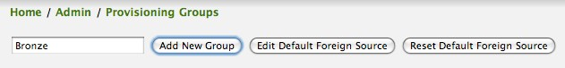

Clicking the _Add New Group_ button will create the group and will redisplay the page including this new group among the list of any group(s) that have already been created.

image:../images/provisioning/00028.jpeg[]

NOTE: At this point, the XML structure for holding the new provisioning group (a.k.a. an import requisition) has been persisted to the '$OPENNMS_ETC/imports/pending' directory.

Clicking the _Edit_ link will bring you to the screen where you can begin the process of defining node entities that will be imported into OpenNMS.
Click the Add Node button will begin the node entity creation process fill in the node label and click the _Save_ button.

.Creating a new Node definition in the Provisioning Group
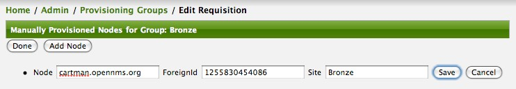

At this point, the provisioning group contains the basic structure of a node entity but it is not complete until the interface(s) and interface service(s) have been defined.
After having clicked the _Save_ button, as we did above presents, in the Web-UI, the options _Add Interface_, _Add Node Category_, and _Add Node Asset_.
Click the _Add Interface_ link to add an interface entity to the node.

.Adding an Interface to the node definition
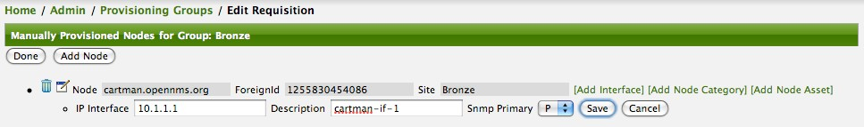

Enter the IP address for this interface entity, a description, and specify the Primary attribute as `P` (Primary), `S` (Secondary), `N` (Not collected), or `C` (Collected) and click the save button.
Now the node entity has an interface for which services can be defined for which the Web-UI now presents the _Add Service_ link.
Add two services (ICMP, SNMP) via this link.

.A complete node definition with all _required_ elements defined.
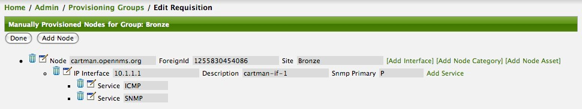

Now the node entity definition contains all the _required_ elements necessary for importing this requisition into OpenNMS.
At this point, all the interfaces that are required for the node should be added.
For example, NAT interfaces should be specified there are services that they provide because they will not be discovered during the Scan Phase.

Two more node definitions will be added for the benefit of this example.

.The completed requisition for the example Bronze Provisioning Group
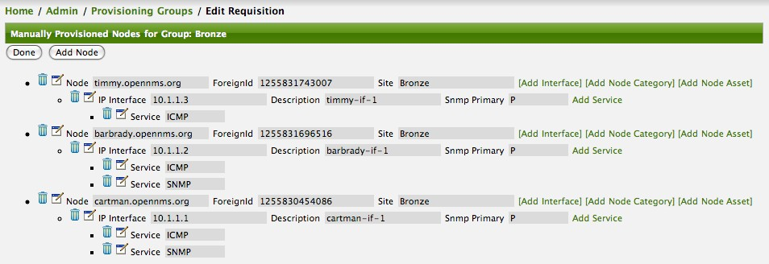

This set of nodes represents an import requisition for the _Bronze_ provisioning group.
As this requisition is being edited via the WebUI, changes are being persisted into the OpenNMS configuration directory '$OPENNMS_etc/imports/' pending as an XML file having the name 'bronze.xml'.

NOTE: The name of the XML file containing the import requisition is the same as the provisioning group name.
Therefore naming your provisioning group without the use of spaces makes them easier to manage on the file system.

Click the _Done_ button to return to the _Provisioning Groups_ list screen.
The details of the “Bronze” group now indicates that there are 3 nodes in the requisition and that there are no nodes in the DB from this group (a.k.a. foreign source).
Additionally, you can see that time the requisition was last modified and the time it last imported are given (the time stamps are stored as attributes inside the requisition and are not the file system time stamps).
These details are indicative of how well the DB represents what is in the requisition.

image:../images/provisioning/00013.jpeg[]

NOTE: You can tell that this is a pending requisition for 2 reasons: 1) there are 3 nodes defined and 0 nodes in the DB, 2) the requisition has been modified since the last import (in this case _never_).

===== Import the Nodes

In this example, you see that there are 3 nodes in the pending requisition and 0 in the DB.
Click the _Import_ button to submit the requisition to the provisioning system (what actually happens is that the Web-UI sends an event to the Provisioner telling it to begin the Import Phase for this group).

NOTE: Do not refresh this page to check the values of these details.
To refresh the details to verify the import, click the _Provisioning Groups_ bread crumb item.

You should be able to immediately verify the importation of this provisioning group because the import happens very quickly.
Provisiond has several threads ready for processing the import operations of the nodes defined in this requisition.

A few SNMP packets are sent and received to get the SNMP details of the node and the interfaces defined in the requisition.
Upon receipt of these packets (or not) each node is inserted as a DB transaction.

.The nodes are now added to OpenNMS and are under management.
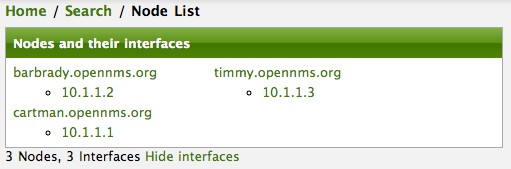

Following the import of a node with thousands of interfaces, you will be able to refresh the Interface table browser on the Node page and see that interfaces and services are being discovered and added in the background.
This is the discovery component of directed discovery.

.Adding a Node

To direct that another node be added from a foreign source (in this example the Bronze Provisioning Group) simply add a new node definition and re-import.
It is important to remember that all the node definitions will be re-imported and the existing managed nodes will be updated, if necessary.

===== Changing a Node

To direct changes to an existing node, simply add, change, or delete elements or attributes of the node definition and re- import.
This is a great feature of having directed specific elements of a node in the requisition because that attributes will simply be changed.
For example, to change the IP address of the Primary SNMP interface for the node, _barbrady.opennms.org_, just change the requisition and re-import.

Each element in the Web-UI has an associated Edit icon
Click this icon to change the IP address for barbrady.opennms.org, click save, and then Click the Done button.

.Changing the IP address of _barbrady.opennms.org_ from 10.1.1.2 to 192.168.1.1
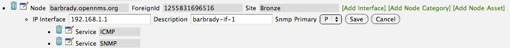

The Web-UI will return you to the _Provisioning Groups_ screen where you will see that there are the time stamp showing that the requisition’s last modification is more recent that the last import time.

.The Provisioning Group must be re-imported
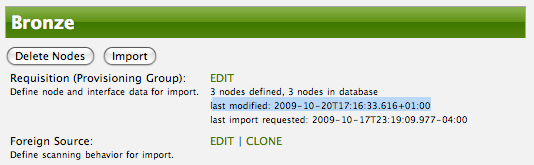

This provides an indication that the group must be re-imported for the changes made to the requisition to take effect.
The IP Interface will be simply updated and all the required events (messages) will be sent to communicate this change within OpenNMS.

.The IP interface for barbrady.opennms.org is immediately updated
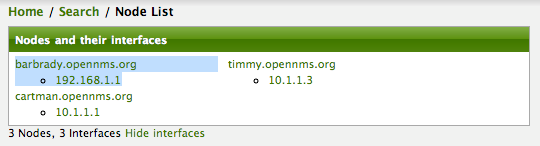

===== Deleting a Node

_Barbrady_ has not been behaving, as one might expect, so it is time to remove him from the system.
Edit the provisioning group, click the delete button next to the node _barbrady.opennms.org_, click the _Done_ button.

.Bronze Provisioning Group definition indicates a node has been removed and requires an import to delete the node entity from the OpenNMS system
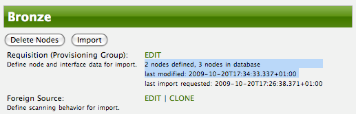

Click the Import button for the Bronze group and the Barbrady node and its interfaces, services, and any other related data will be immediately deleted from the OpenNMS system.
All the required Events (messages) will be sent by Provisiond to provide indication to the OpenNMS system that the node Barbrady has been deleted.

.Barbrady has been deleted
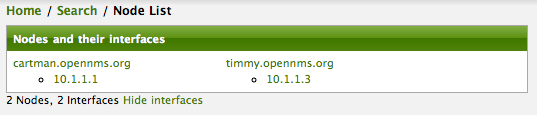

===== Deleting all the Nodes

There is a convenient way to delete all the nodes that have been provided from a specific foreign source.
From the main _Admin/Provisioning Groups_ screen in the Web-UI, click the _Delete Nodes_ button.
This button deletes all the nodes defined in the Bronze requisition.
It is very important to note that once this is done, it cannot be undone!
Well it can’t be undone from the Web-UI and can only be undone if you’ve been good about keeping a backup copy of your '$OPENMS_ETC/' directory tree.
If you’ve made a mistake, before you re-import the requisition, restore the 'Bronze.xml' requisition from your backup copy to the '$OPENNMS_ETC/imports' directory.

.All node definitions have been removed from the Bronze requisition. The Web-UI indicates an import is now required to remove them from OpenNMS.
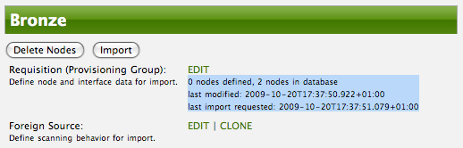

Clicking the _Import_ button will cause the _Audit Phase_ of _Provisiond_ to determine that all the nodes from the _Bronze_ group (foreign source) should be deleted from the DB and will create _Delete_ operations.
At this point, if you are satisfied that the nodes have been deleted and that you will no longer require nodes to be defined in this Group, you will see that the _Delete Nodes_ button has now changed to the _Delete Group_ button.
The _Delete Group_ button is displayed when there are no nodes entities from that group (foreign source) in OpenNMS.

When no node entities from the group exist in OpenNMS, then the _Delete Group_ button is displayed.

==== Advanced Provisioning Example

In the previous example, we provisioned 3 nodes and let _Provisiond_ complete all of its import phases using a default foreign source definition.
Each Provisioning Group can have a separate foreign source definition that controls:

* The rescan interval
* The services to be detected
* The policies to be applied

This example will demonstrate how to create a foreign source definition and how it is used to control the behavior of Provisiond when importing a _Provisioning Group/foreign source requisition_.

First let’s simply provision the node and let the default foreign source definition apply.

.The node definition used for the Advanced Provisioning Example
image:../images/provisioning/00025.jpeg[]

Following the import, All the IP and SNMP interfaces, in addition to the interface specified in the requisition, have been discovered and added to the node entity.
The default foreign source definition has no polices for controlling which interfaces that are discovered either get persisted or managed by OpenNMS.

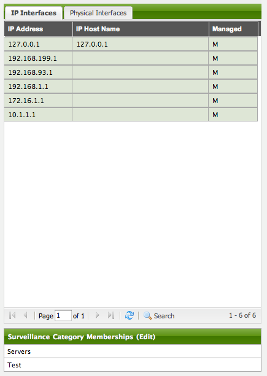

.Logical and Physical interface and Service entities directed and discovered by Provisiond.
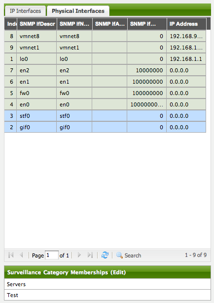

image:../images/provisioning/000018.png[]

===== Service Detection

As IP interfaces are found during the node scan process, service detection tasks are scheduled for each IP interface.
The service detections defined in the foreign source determines which services are to be detected and how (i.e. the values of the parameters that parameters control how the service is detected, port, timeout, etc.).

====== Applying a New Foreign Source Definition

This example node has been provisioned using the Default foreign source definition.
By navigating to the Provisioning Groups screen in the OpenNMS Web-UI and clicking the Edit Foreign Source link of a group, you can create a new foreign source definition that defines service detection and policies.
The policies determine entity persistence and/or set attributes on the discovered entities that control OpenNMS’ management behaviors.

.When creating a new foreign source definition, the default definition is used as a template.
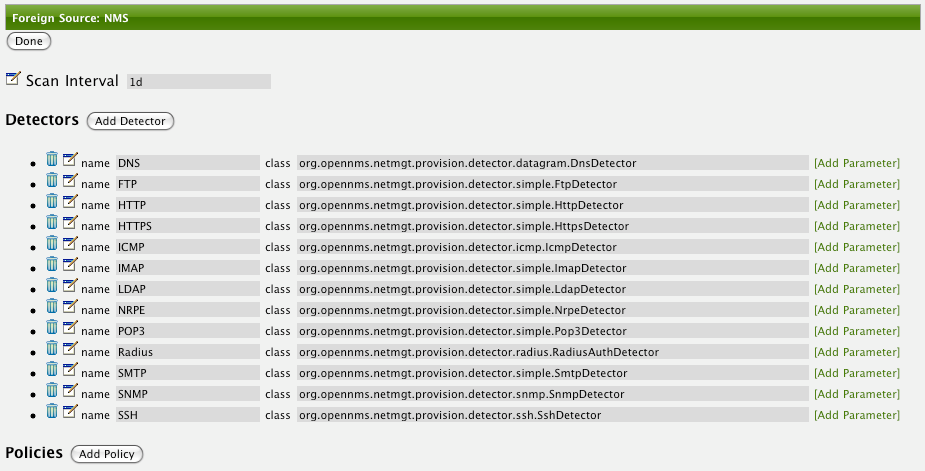

In this UI, new Detectors can be added, changed, and removed.
For this example, we will remove detection of all services accept ICMP and DNS, change the timeout of ICMP detection, and a new Service detection for OpenNMS Web-UI.

.Custom foreign source definition created for NMS Provisioning Group (foreign source).
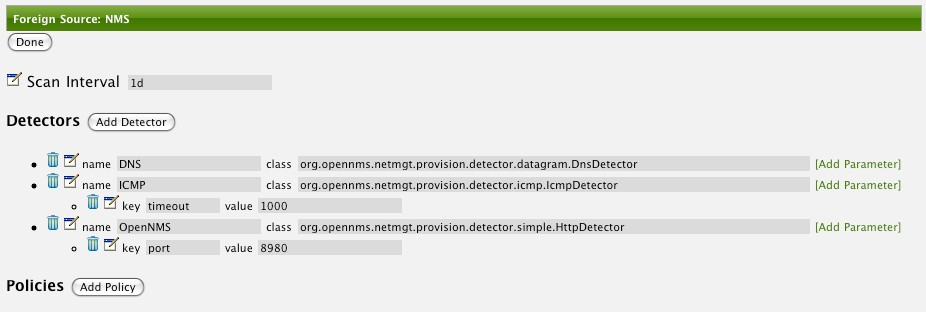

Click the Done button and re-import the NMS Provisioning Group.
During this and any subsequent re-imports or re- scans, the OpenNMS detector will be active, and the detectors that have been removed will no longer test for the related services for the interfaces on nodes managed in the provisioning group (requisition), however, the currently detected services will not be removed.
There are 2 ways to delete the previously detected services:

. Delete the node in the provisioning group, re-import, define it again, and finally re-import again
. Use the ReST API to delete unwanted services. Use this command to remove each unwanted service from each interface, iteratively:

 curl -X DELETE -H "Content-Type: application/xml" -u admin:admin http://localhost:8980/opennms/rest/nodes/6/ipinterfaces/172.16.1.1/services/DNS

TIP: There is a sneaky way to do #1.
Edit the provisioning group and just change the foreign ID.
That will make Provisiond think that a node was deleted and a new node was added in the same requisition!
Use this hint with caution and an full understanding of the impact of deleting an existing node.

====== Provisioning with Policies

The Policy API in Provisiond allow you to control the persistence of discovered IP and SNMP Interface entities and Node Categories during the Scan phase.

.Matching IP Interface Policy

The Matching IP Interface policy controls whether discovered I interfaces are to be persisted and if they are to be persisted, whether or not they will be forced to be Managed or Unmanaged.

Continuing with this example Provisioning Group, we are going to define a few policies that:

a. Prevent discovered 10 network addresses from being persisted
b. Force 192.168 network addresses to be unmanaged

From the foreign source definition screen, click the Add Policy button and you the definition of a new policy will begin with a field for naming the policy and a drop down list of the currently installed policies.
Name the policy _no10s_, make sure that the _Match IP Interface policy_ is specified in the class list and click the Save button.
This action will automatically add all the parameters required for the policy.

The two required parameters for this policy are action and matchBehavior.

.The action parameter can be set to _DO_NOT_PERSIST_, _Manage_, or _UnManage_.
image:../images/provisioning/00001.jpeg[]

.Creating a policy to prevent persistence of 10 network IP interfaces.

The _DO_NOT_PERSIST_ action does just what it indicates, it prevents discovered IP interface entities from being added to OpenNMS when the _matchBehavior_ is satisfied.
The Manage and UnManage values for this action allow the IP interface entity to be persisted by control whether or not that interface should be managed by OpenNMS.

The matchBehavior action is a boolean control that determines how the optional parameters will be evaluated.
Setting this parameter’s value to _ALL_PARAMETERS_ causes _Provisiond_ to evaluate each optional parameter with boolean _AND_ logic and the value _ANY_PARAMETERS_ will cause _OR_ logic to be applied.

Now we will add one of the optional parameters to filter the 10 network addresses.
The Matching IP Interface policy supports two additional parameters, _hostName_ and _ipAddress_.
Click the _Add Parameter_ link and choose _ipAddress_ as the _key_.
The _value_ for either of the optional parameters can be an exact or regular expression match.
As in most configurations in OpenNMS where regular expression matching can be optionally applied, prefix the value with the `~` character.

.Example Matching IP Interface Policy to not Persist 10 Network addresses
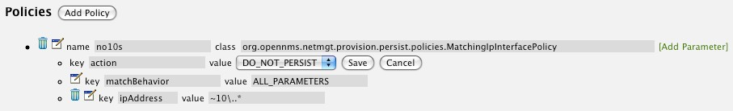

Any subsequent scan of the node or re-imports of NMS provisioning group will force this policy to be applied.
IP Interface entities that already exist that match this policy will not be deleted.
Existing interfaces can be deleted by recreating the node in the _Provisioning Groups_ screen (simply change the foreign ID and re-import the group) or by using the ReST API:

 curl -X DELETE -H "Content-Type: application/xml" -u admin:admin http://localhost:8980/opennms/rest/nodes/6/ipinterfaces/10.1.1.1

The next step in this example is to define a policy that sets discovered 192.168 network addresses to be unmanaged (not managed) in OpenNMS.
Again, click the Add Policy button and let’s call this policy _noMgt192168s_.
Again, choose the Mach IP Interface policy and this time set the action to _UNMANAGE_.

.Policy to not manage IP interfaces from 192.168 networks
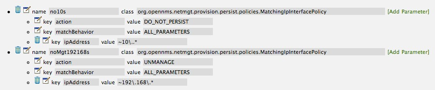

NOTE: The _UNMANAGE_ behavior will be applied to existing interfaces.

.Matching SNMP Interface Policy

Like the Matching IP Interface Policy, this policy controls the whether discovered SNMP interface entities are to be persisted and whether or not OpenNMS should collect performance metrics from the SNMP agent for Interface’s index (MIB2 IfIndex).

In this example, we are going to create a policy that doesn’t persist interfaces that are _AAL5_ over _ATM_ or type _49_ (_ifType_).
Following the same steps as when creating an IP Management Policy, edit the foreign source definition and create a new policy.
Let’s call it: _noAAL5s_.
We’ll use Match SNMP Interface class for each policy and add a parameter with _ifType_ as the key and _49_ as the value.

.Matching SNMP Interface Policy example for Persistence and Data Collection
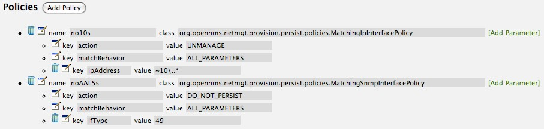

NOTE: At the appropriate time during the scanning phase, Provisiond will
evaluate the policies in the foreign source definition and take
appropriate action. If during the policy evaluation process any policy
matches for a “DO_NOT_PERSIST” action, no further policy evaluations
will happen for that particular entity (IP Interface, SNMP Interface).

.Node Categorization Policy

With this policy, nodes entities will automatically be assigned categories.
The policy is defined in the same manner as the IP and SNMP interface polices.
Click the Add Policy button and give the policy name, `cisco` and choose the _Set Node Category_ class.
Edit the required _category_ key and set the value to `Cisco`.
Add a policy parameter and choose the _sysObjectId_ key with a value `~^\.1\.3\.6\.1\.4\.1\.9\..*`.

.Example: Node Category setting policy
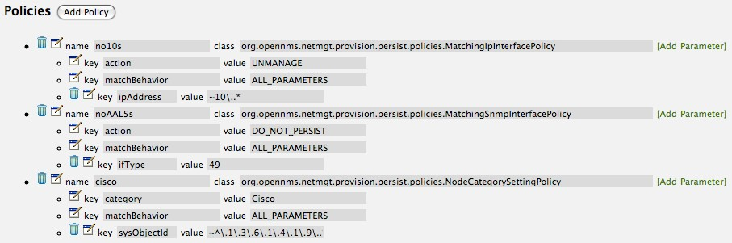

===== New Import Capabilities

Several new XML entities have been added to the import requisition since the introduction of the OpenNMS Importer service in version 1.6.
So, in addition to provisioning the basic node, interface, service, and node categories, you can now also provision asset data.

====== Provisiond Configuration

The configuration of the Provisioning system has moved from a properties file ('model-importer.properties') to an XML based configuration container.
The configuration is now extensible to allow the definition of 0 or more import requisitions each with their own _Cron_ based schedule for automatic importing from various sources (intended for integration with external URL such as HTTP and this new DNS protocol handler.

A default configuration is provided in the OpenNMS 'etc/' directory and is called: 'provisiond-configuration.xml'.
This default configuration has an example for scheduling an import from a DNS server running on the localhost requesting nodes from the zone, localhost and will be imported once per day at the stroke of midnight. Not very practical but is a good example.

[source,xml]
----
<?xml version="1.0" encoding="UTF-8"?>
    <provisiond-configuration xmlns:xsi="http://www.w3.org/2001/XMLSchema-instance" xsi:schemaLocation="http://xmlns.opennms.org/xsd/config/provisiond-configuration"
        foreign-source-dir="/opt/opennms/etc/foreign-sources"
        requistion-dir="/opt/opennms/etc/imports"
        importThreads="8"
        scanThreads="10"
        rescanThreads="10"
        writeThreads="8" >
    <!--
        http://quartz.sourceforge.net/javadoc/org/quartz/CronTrigger.html[http://quartz.sourceforge.net/javadoc/org/quartz/CronTrigger.html]
        Field Name Allowed Values Allowed Special Characters
        Seconds 0-59 , - * / Minutes 0-59 , - * / Hours 0-23 , - * /
        Day-of-month1-31, - * ? / L W C Month1-12 or JAN-DEC, - * /
        Day-of-Week1-7 or SUN-SAT, - * ? / L C # Year (Opt)empty, 1970-2099, - * /
    -->

    <requisition-def import-name="NMS"
                     import-url-resource="file://opt/opennms/etc/imports/NMS.xml">
        <cron-schedule>0 0 0 * * ? *</cron-schedule> <!-- daily, at midnight -->
    </requisition-def>
</provisiond-configuration>
----

.Configuration Reload

Like many of the daemon configurations in the 1.7 branch, _Provisiond’s_ configuration is re-loadable without having to restart OpenNMS.
Use the reloadDaemonConfig uei:

 /opt/opennms/bin/send-event.pl uei.opennms.org/internal/reloadDaemonConfig --parm 'daemonName Provisiond'

This means that you don't have to restart OpenNMS every time you update the configuration!

====== Provisioning Asset Data

The Provisioning Groups Web-UI had been updated to expose the ability to add Node Asset data in an import requisition.
Click the _Add Node Asset_ link and you can select from a drop down list all the possible node asset attributes that can be defined.

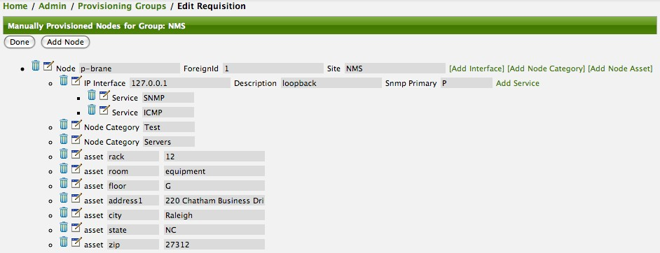

After an import, you can navigate to the _Node Page_ and click the _Asset Info_ link and see the asset data that was just provided in the requisition.

image:../images/provisioning/000004.png[]

===== External Requisition Sources

Because Provisiond takes a _URL_ as the location service for import requisitions, OpenNMS can be easily extended to support sources in addition to the native URL handling provided by Java: _file://_, _http://_, and _https://_.
When you configure _Provisiond_ to import requisitions on a schedule you specify using a _URL_ Resource.
For requisitions created by the _Provisioning Groups_ WebUI, you can specify a file based URL.

CAUTION: <need further documentation>

====== Provisioning Nodes from DNS

The new Provisioning service in OpenNMS is continuously improving and adapting to the needs of the community.
One of the most recent enhancements to the system is built upon the very flexible and extensible API of referencing an import requisition's location via a URL.
Most commmonly, these URLs are files on the file system (i.e. 'file:/opt/opennms/etc/' 'imports/<my-provisioning-group.xml>') as requisitions created by the Provisioning Groups UI. However, these same requistions for adding, updating, and deleting nodes (based on the original model importer) can also come from URLs specifying the HTTP protocol: http://myinventory.server.org/nodes.cgi)

Now, using Java's extensible protocol handling specification, a new protocol handler was created so that a URL can be specified for requesting a Zone Transfer (_AXFR_) request from a DNS server.
The _A records_ are recorded and used to build an import requisition.
This is handy for organizations that use DNS (possibly coupled with an IP management tool) as the data base of record for nodes in the network.
So, rather than ping sweeping the network or entering the nodes manually into OpenNMS Provisioning UI, nodes can be managed via 1 or more DNS servers.
The format of the URL for this new protocol handler is:

 dns://<host>[:port]/<zone>[/<foreign-source>/][?expression=<regex>]

.Simple Example

 dns://my-dns-server/myzone.com

This will import all _A records_ from the host _my-dns-server_ on port 53 (default port) from zone _myzone.com_ and since the foreign source (a.k.a. the provisioning group) is not specified it will default to the specified zone.

.Using a Regular Expression Filter

You can also specify a subset of the _A records_ from the zone transfer using a regular expression:

 dns://my-dns-server/myzone.com/portland/?expression=^por-.*

This will import all nodes from the same server and zone but will only manage the nodes in the zone matching the regular expression `^port-.*` and will and they will be assigned a unique foreign source (provisioning group) for managing these nodes as a subset of nodes from within the specified zone.

.URL Encoding

If your expression requires URL encoding (for example you need to use a `?` in the expression) it must be properly encoded.

 dns://my-dns-server/myzone.com/portland/?expression=^por[0-9]%3F

.DNS Setup

Currently, the DNS server requires to be setup to allow a zone transfer from the OpenNMS server.
It is recommended that a secondary DNS server is running on OpenNMS and that the OpenNMS server be allowed to request a zone transfer.
A quick way to test if zone transfers are working is:

 dig -t AXFR @<dn5Server> <zone>

=== Adapters

The OpenNMS _Provisiond API_ also supports _Provisioning Adapters_ (plugins) for integration with external systems during the provisioning Import phase.
When node entities are added, updated, deleted, or receive a configuration management change event, OpenNMS will call the adapter for the provisioning activities with integrated systems.

Currently, OpenNMS supports the following adapters:

==== DDNS Adapter

The Opposite end of _Provisiond_ integration from the DNS Requisition Import, is the _DDNS adapter_.
This adapter uses the _dynamic DNS protocol_ to update a DNS system as nodes are provisioned into OpenNMS.
To configure this adapter, edit the 'opennms.properties' file and set the `importer.adapter.dns.server property`:

 importer.adapter.dns.server=192.168.1.1

==== RANCID Adapter

Integration has been integrated with RANCID though this new API.

CAUTION: <More documentation needed>

CAUTION: Maps (soon to be moved to Mapd) <documentation required>

CAUTION: WiMax-Link (soon to be moved to Linkd) <documentation required>

=== Integrating with Provisiond

The ReST API should be used for integration from other provisioning systems with OpenNMS.
The ReST API provides an interface for defining foreign sources and requisitions.

==== Provisioning Groups of Nodes

Just as with the WebUI, groups of nodes can be managed via the ReST API from an external system.
The steps are:

. Create a Foreign Source (if not using the default) for the group
. Update the SNMP configuration for each node in the group
. Create/Update the group of nodes

==== Example

===== Step 1 - Create a Foreign Source

If policies for this group of nodes are going to be specified differently than the default policy, then a foreign source should be created for the group.
Using the ReST API, a foreign source can be provided.
Here is an example:

NOTE: The XML can be imbedded in the `curl` command option `-d` or be referenced from a file if the `@` prefix is used with the file name as in this case.

The XML file: 'customer-a.foreign-source.xml':

[source, xml]
----
<?xml version="1.0" encoding="UTF-8" standalone="yes"?>
<foreign-source date-stamp="2009-10-12T17:26:11.616-04:00" name="customer-a" xmlns="http://xmlns.opennms.org/xsd/config/foreign-source">
    <scan-interval>1d</scan-interval>
    <detectors>
        <detector class="org.opennms.netmgt.provision.detector.icmp.IcmpDetector" name="ICMP"/>
        <detector class="org.opennms.netmgt.provision.detector.snmp.SnmpDetector" name="SNMP"/>
    </detectors>
    <policies>
        <policy class="org.opennms.netmgt.provision.persist.policies.MatchingIpInterfacePolicy" name="no-192-168">
            <parameter value="UNMANAGE" key="action"/>
            <parameter value="ALL_PARAMETERS" key="matchBehavior"/>
            <parameter value="~^192\.168\..*" key="ipAddress"/>
        </policy>
    </policies>
</foreign-source>
----

Here is an example `curl` command used to create the foreign source with the above foreign source specification above:

 curl -v -u admin:admin -X POST -H 'Content-type: application/xml' -d '@customer-a.foreign-source.xml' http://localhost:8980/opennms/rest/foreignSources

Now that you’ve created the foreign source, it needs to be deployed by Provisiond.
Here an the example using the `curl` command to deploy the foreign source:

 curl -v -u admin:admin http://localhost:8980/opennms/rest/foreignSources/pending/customer-a/deploy -X PUT

NOTE: The current API doesn’t strictly follow the ReST design guidelines and will be updated in a later release.

===== Step 2 - Update the SNMP configuration

The implementation only supports a _PUT_ request because it is an implied "Update" of the configuration since it requires an IP address and all IPs have a default configuration.
This request is is passed to the SNMP configuration factory in OpenNMS for optimization of the configuration store 'snmp-config.xml'.
This example changes the community string for the IP address 10.1.1.1 to `yRuSonoZ`.

NOTE: Community string is the only required element

 curl -v -X PUT -H "Content-Type: application/xml" -H "Accept: application/xml" -d <snmp-info><community>yRuSonoZ</community><port>161</port><retries>1</retries><timeout>2000</timeout><version>v2c</version></snmp-info>" -u admin:admin http://localhost:8980/opennms/rest/snmpConfig/10.1.1.1

===== Step 3 - Create/Update the Requisition

This example adds 2 nodes to the Provisioning Group, _customer-a_.
Note that the foreign-source attribute typically has a 1 to 1 relationship to the name of the Provisioning Group requisition.
There is a direct relationship between the foreign- source attribute in the requisition and the foreign source policy specification.
Also, typically, the name of the provisioning group will also be the same.
In the following example, the ReST API will automatically create a provisioning group based on the value foreign-source attribute specified in the XML requisition.

 curl -X POST -H "Content-Type: application/xml" -d "<?xml version="1.0" encoding="UTF-8"?><model-import xmlns="http://xmlns.opennms.org/xsd/config/model-import" date-stamp="2009-03-07T17:56:53.123-05:00" last-import="2009-03-07T17:56:53.117-05:00" foreign-source="customer-a"><node node-label="p-brane" foreign-id="1" ><interface ip-addr="10.0.1.3" descr="en1" status="1" snmp-primary="P"><monitored-service service-name="ICMP"/><monitored-service service-name="SNMP"/></interface><category name="Production"/><category name="Routers"/></node><node node-label="m-brane" foreign-id="1" ><interface ip-addr="10.0.1.4" descr="en1" status="1" snmp-primary="P"><monitored-service service-name="ICMP"/><monitored-service service-name="SNMP"/></interface><category name="Production"/><category name="Routers"/></node></model-import>" -u admin:admin http://localhost:8980/opennms/rest/requisitions

A provisioning group file called 'etc/imports/customer-a.xml' will be found on the OpenNMS system following the successful completion of this `curl` command and will also be visible via the WebUI.

NOTE: _Add_, _Update_, _Delete_ operations are handled via the ReST API in the same manner as described in detailed specification.

.Adding a Node to a Current Requisition

=== Provisioning Single Nodes (Quick Add Node)

Often, it is requested that a single node add/update be completed for an already defined provisioning group.
There is a ReST API for the _Add Node_ implementation found in the OpenNMS Web-UI.
For this to work, the provisioning group must already exist in the system even if there are no nodes defined in the group.

. Create a foreign source (if required)
. Specify SNMP configuration
. Provide a single node with the following specification

=== Fine Grained Provisioning Using _provision.pl_

We have created a Perl script to help your team with this provisioning.
It is in the '/opt/opennms/bin/' directory when you install from our SNAPSHOT builds.
The script has most all the operations you need for interfacing from WAVE and you should be able to use it or duplicate the code in WAVE.
The options that are not available can be added to the script if you need them but everything is fully available in the REST interface.
The script provides an easy interface to the REST API and should help a lot but making the examples easier to read and having code to inspect sometimes makes understanding the API much easier, as well.

The script '/opt/opennms/bin/provision.pl', has many options but the first 3 optional parameters are described here:

NOTE: You can use `--help` to the script to see all the available options.

 --username (default: admin)
 --password (default: admin)
 --url (default: http://localhost:8980/opennms/rest)

We stand-by to help with any questions they may have.
Additionally, we should get the latest software installed so that they can start testing.
It would be good to have installs from the nightly SNAPSHOT builds so that we can keep it easily and quickly updated if there are any changes we have to make for you.

==== First, Create a new Provisioning Group

Provisioning Groups are created with import requisitions.
The script provides an easy access to the REST API using the _requisition_ option:

 /opt/opennms/bin/provision.pl requisition customer1

This command will create a new requisition (provisioning group) in the '/opt/opennms/etc/imports/pending/' directory.
It will be an empty requisition (provisioning group).
Empty meaning there will be the import definition only with no nodes.

IMPORTANT: Notice that the group is in the 'pending' directory.
This allows you to iteratively create the group and then later actually import/provide the nodes in the group into OpenNMS.
This hands all adds/changes/deletes at once.
So, you could be making changes all day and then at night either have a schedule in OpenNMS that imports the group automatically or you can send a command through the REST service from WAVE to have the pending group imported/reimported.
This is defined in the docs.

[source, xml]
----
$ cat /opt/opennms/etc/imports/pending/customer1.xml
<?xml version="1.0" encoding="UTF-8" standalone="yes"?>
<model-import foreign-source="customer1"
              date-stamp="2010-01-12T09:29:23.104-05:00"
              xmlns="http://xmlns.opennms.org/xsd/config/model-import">
</model-import>
----

You can also get a list of all existing provisioning groups (import requisitions) with the `list` option of the `provision.pl` script:

 /opt/opennms/bin/provision.pl list

==== Add a Node to an Existing Provisioning Group

Okay, the script we provided helps one to managed provisioning group elements at a very fine grained level.
This example shows you how tohandle adding a node and all the node elements with fine grained requests.
Note, that you could create the resulting XML in WAVE and send the entire group as an XML document to the REST API as I've attempted to document in the docs. I will be including this example in a updated version of the docs, ASAP.

===== Create the Node Element

 /opt/opennms/bin/provision.pl node add customer1 1 node-a

This command creates a node element in the provisioning group (a.k.a requisition) _customer1_ called _node-a_ using the scripts _node_ option.
Note it has no interfaces or services, yet.

[source, xml]
----
<?xml version="1.0" encoding="UTF-8" standalone="yes"?>
<model-import foreign-source="customer1"
              date-stamp="2010-01-12T09:29:23.104-05:00" xmlns="http://xmlns.opennms.org/xsd/config/model-import">
    <node node-label="node-a" foreign-id="1"/>
</model-import>
----

===== Add a Interface Element to that Node

 /opt/opennms/bin/provision.pl interface add customer1 1 127.0.0.1

This command adds an interface element to the node element using the _interface_ option to the 'provision.pl' command and it can now be seen in the pending requisition:

[source, xml]
----
<?xml version="1.0" encoding="UTF-8" standalone="yes"?>
<model-import foreign-source="customer1"
              date-stamp="2010-01-12T09:31:21.029-05:00" xmlns="http://xmlns.opennms.org/xsd/config/model-import">
    <node node-label="node-a" foreign-id="1">
        <interface ip-addr="127.0.0.1"/>
    </node>
</model-import>
----

===== Add a Couple of Services to that Interface

 /opt/opennms/bin/provision.pl service add customer1 1 127.0.0.1 ICMP
 /opt/opennms/bin/provision.pl service add customer1 1 127.0.0.1 SNMP

This adds the 2 services to the specified 127.0.0.1 interface and is now in the pending XML document.

NOTE: These Services must already be defined in the foreign-source definition for this _group_.
There is a default foreign source definition, btw.
This is covered in the docs we provided.

[source, xml]
----
<?xml version="1.0" encoding="UTF-8" standalone="yes"?>
<model-import foreign-source="customer1"
              date-stamp="2010-01-12T09:32:14.885-05:00" xmlns="http://xmlns.opennms.org/xsd/config/model-import">
    <node node-label="node-a" foreign-id="1">
        <interface ip-addr="127.0.0.1">
            <monitored-service service-name="ICMP"/>
            <monitored-service service-name="SNMP"/>
        </interface>
    </node>
</model-import>
----

===== Set the Primary SNMP Interface

 /opt/opennms/bin/provision.pl interface set customer1 1 127.0.0.1 snmp-primary P

This sets the 127.0.0.1 interface to be the Primary SNMP interface:

[source, xml]
----
<?xml version="1.0" encoding="UTF-8" standalone="yes"?>
<model-import last-import="2010-01-12T09:37:27.373-05:00"
              foreign-source="customer1" date- stamp="2010-01-12T11:12:23.738-05:00" xmlns="http://xmlns.opennms.org/xsd/config/model-import">
    <node node-label="node-a" foreign-id="1">
        <interface snmp-primary="P" ip-addr="127.0.0.1">
            <monitored-service service-name="ICMP"/>
            <monitored-service service-name="SNMP"/>
        </interface>
    </node>
</model-import>
----

===== Add a couple Node Categories

 /opt/opennms/bin/provision.pl category add customer1 1 Routers
 /opt/opennms/bin/provision.pl category add customer1 1 Production

This adds the 2 categories to the node and is now in the pending XML document.

NOTE: These categories are: a) case sensitive and b) do not have to already be defined in OpenNMS.
They will be created on the fly during the import if they do not already exist.

[source, xml]
----
<?xml version="1.0" encoding="UTF-8" standalone="yes"?>
<model-import foreign-source="customer1"
              date-stamp="2010-01-12T09:33:57.740-05:00" xmlns="http://xmlns.opennms.org/xsd/config/model-import">
    <node node-label="node-a" foreign-id="1">
        <interface ip-addr="127.0.0.1">
            <monitored-service service-name="ICMP"/>
            <monitored-service service-name="SNMP"/>
        </interface>
        <category name="Servers"/>
        <category name="Production"/>
    </node>
</model-import>
----

===== Setting Asset Fields on a Node

 /opt/opennms/bin/provision.pl asset add customer1 1 serialnumber 9999

This will add value of `9999` to the asset field: _serialnumber_:

[source, xml]
----
<?xml version="1.0" encoding="UTF-8" standalone="yes"?>
<model-import foreign-source="customer1"
              date-stamp="2010-01-12T09:35:48.343-05:00" xmlns="http://xmlns.opennms.org/xsd/config/model-import">
    <node node-label="node-a" foreign-id="1">
        <interface ip-addr="127.0.0.1">
            <monitored-service service-name="ICMP"/>
            <monitored-service service-name="SNMP"/>
        </interface>
        <category name="Servers"/>
        <category name="Production"/>
        <asset value="9999" name="serialnumber"/>
    </node>
</model-import>
----

.Deploy the Import Requisition (Creating the Group)

 /opt/opennms/bin/provision.pl requisition import customer1

This will cause OpenNMS Provisiond to import the pending requisition.
The XML document will moved from the '/opt/' 'opennms/imports/pending' directory to the '/opt/opennms/imports' directory.
The philosophy is that the XML document in the 'imports/' directory should be reflective of what is actually supposed to be in the DB.

CAUTION: The behavior changed. Mixing ReST and UI is dangerous.

.Deleting a Node from an Import Requisition (Provisioning Group)

Very much the same as the add, accept, a single delete command and a re-import is required.
What happens is that the audit phase is run by Provisiond (this is detailed in the docs we sent) and it will be determined that a node has been removed from the group (requisition) and the node will be deleted from the DB and all services will stop activities related to it.

 /opt/opennms/bin/provision.pl node delete customer1 1 node-a
 /opt/opennms/bin/provision.pl requisition import customer1

This, also, will create a copy of the currently deployed requisition, remove the node-a node element, and place it in the pending directory, so it too must be deployed so that the node is removed from the provisioning group.

 /opt/opennms/bin/provision.pl requisition import customer1

This completes the life cycle of managing a node element, iteratively, in a import requisition.

=== Yet Other API Examples

.List the Nodes in a Provisioning Group

The 'provision.pl' script doesn't supply this feature but you can get it via the REST API. Here is an example using `curl`:

[source, bash]
----
#!/bin/bash
REQ=$1
curl -X GET -H "Content-Type: application/xml" -u admin:admin http://localhost:8980/opennms/rest/requisitions/$REQ 2>/dev/null | xmllint --format -
----
