== Issues in JIRA and GitHub workflow

Changes in the official documentation and code base are tracked by JIRA - the link:http://issues.opennms.org[issue tracker] of OpenNMS.
This is the main tool in the project to organize tasks and plan releases.
When a new version of OpenNMS is released, all issues are reflected in the release notes.

It is required to have link:http://issues.opennms.org/secure/Signup!default.jspa[JIRA account] for creating and commenting issues and a link:https://github.com/join[GitHub account] for giving your contribution as _Pull Request_.

The main workflow to add or fix something is defined as the following:

. Create an issue in JIRA.
    The issue number is a unique identifier and is used as a reference, e.g. NMS-7214
. link:https://help.github.com/articles/fork-a-repo[Fork] OpenNMS to your private GitHub repository
. Create a feature branch from `develop` with the following name schema: `NMS-<number>-<Your-Issue-Headline>`
. Add a link of your working branch to your JIRA issue and allow others to help
. Create or fix documentation
. When you've finished, send a _Pull Request_ of your changes to the OpenNMS repository
. Add a review header in your _Pull Request_ comment message
. Add a link with to the _Pull Request_ and ask for a review
. If the review is worked in, the _Pull Request_ will be merged into the codebase and is now in the official release cycle.

=== Example workflow creating documentation

The following example describes a workflow how to create a new documentation for the _DnsMonitor_.

 * Everything starts with an JIRA issue

[[guide-doc-gitflow-create-issue]]
.Create or pick an issue
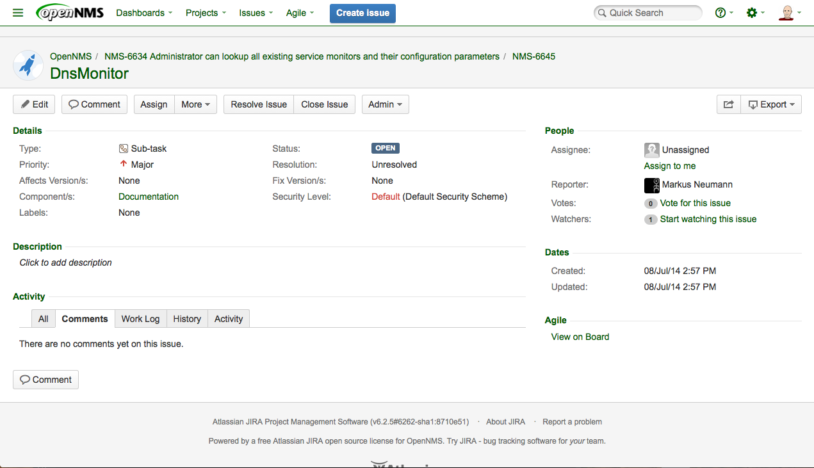

 * Fork the OpenNMS project in your GitHub repository.
 * Go to your GitHub account with your repositories and create working branch from _develop_, which is the default so you don't have to change anything.
 * Create a working branch for the JIRA issue you want to work on with the given name schema:

 NMS-<number>-docs-<Subject-without-spaces>

For our example: `NMS-6634-docs-DnsMonitor`.
This name is used later in the _Pull Request_ and helps to identify and track changes driven by this issue.
Type in the name in the input field and GitHub create the branch for you.

.Create a working branch for the JIRA issue in your repository
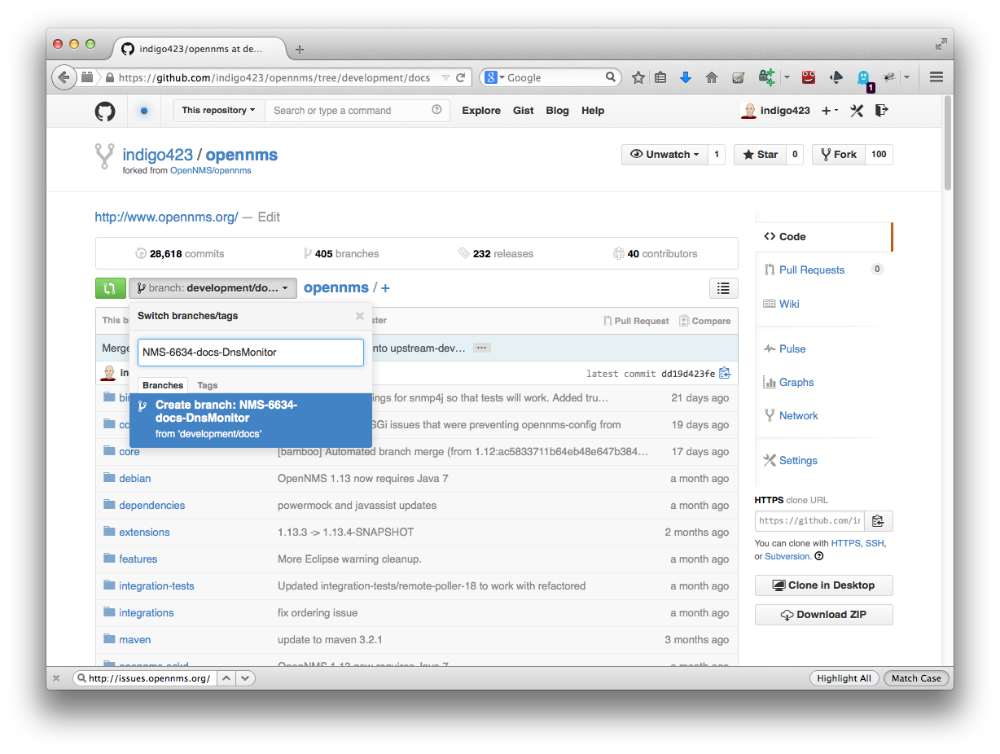

.Create a link in the JIRA issue to your working branch, it indicates somebody is working on it.
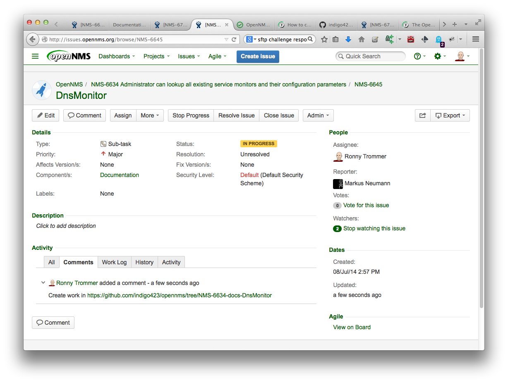

There are two ways to work on the issue.

 * _Option 1_: Make a local copy and work on your local computer
 * _Option 2_: Edit directly all the files online in the GitHub web editor

==== Work on your computer locally

To work on your local computer link:http://git-scm.com[_git_] or the link:https://windows.github.com[_GitHub GUI_] is required.
Clone your repository to you local computer with

 git clone https://github.com/<your-github-nick>/opennms.git

It will download the repository with all the branches to your local system in the 'opennms' directory.
By default you are in the _develop_ branch of OpenNMS.
You can switch to your previously created working branch with the following command:

 git checkout -b NMS-6634-docs-DnsMonitor origin/NMS-6634-docs-DnsMonitor

You can show list all existing branches with

  git branch -r

Now you have your working branch where you can start your contribution.

.Create the documentation and save it!
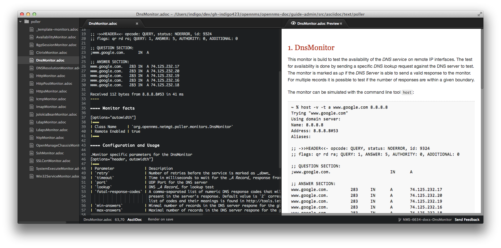

The command `git status` gives you all changes.
To add your work to the version controlled history you have to add your changes to a commit.
In our example we have created the 'DnsMonitor.adoc' file and it is shown as currently untracked in git.

The command

 git add DnsMonitor.adoc

adds this file for the next commit.

NOTE: The full path to the file to add depends on your current location in the file system.

.Add your created or modified files with git add.
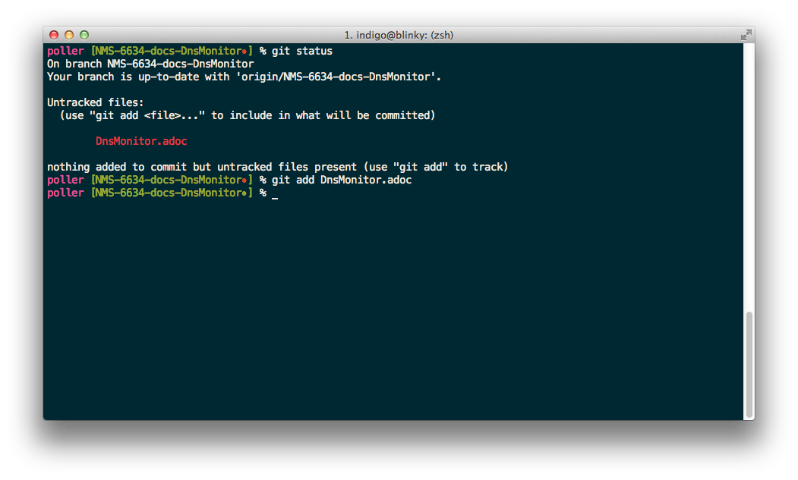

Write a comment which explains what you did.
The first line in the commit message is used as a subject line and should contain the JIRA issue number and the JIRA issue subject.
After the subject keep one empty line and you can use bullet points to describe your changes

.Git comment with a subject line and bullet points for the description
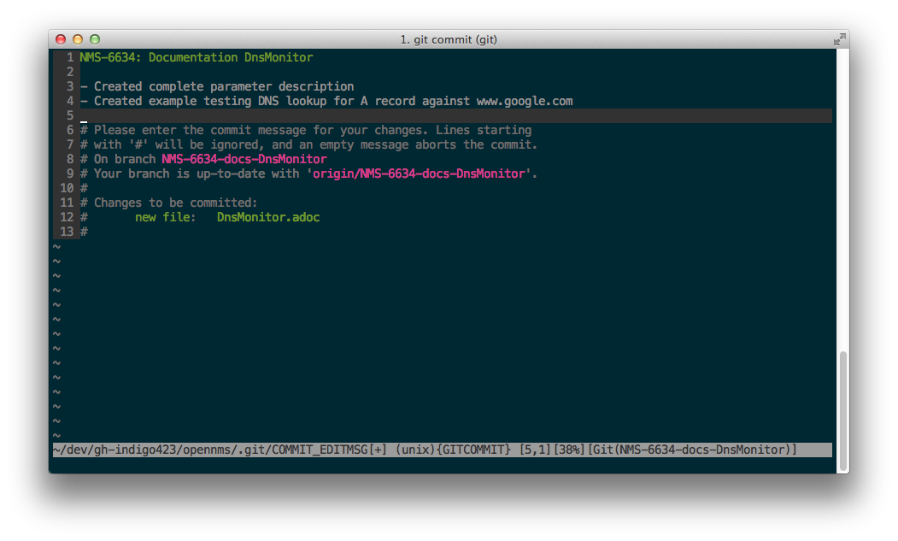

The commit with your change is now stored in the local history of your repository.
With the following command you can upload your changes to your GitHub repository.

 git push

.Upload your changes to your GitHub repository
image::../images/07_git-push.png[]

NOTE: Upload changes to your repository doesn't have any effect on the project.
      You can use it as your backup and to stage your working progress.
      It also allows others to help you in your current working branch.

The next step is sending your changes to the official OpenNMS repository described in section <<guidedoc-gitflow-send-pull-request>>.

==== Work with the GitHub Web editor

It is possible to work completely on the GitHub editor.

WARNING: Be careful if you don't have a reliable internet connection.
         It could be possible you loose the content in case of connection loss.

You can create a new file your repository as following:

.Create a new file with the `+` in (1)
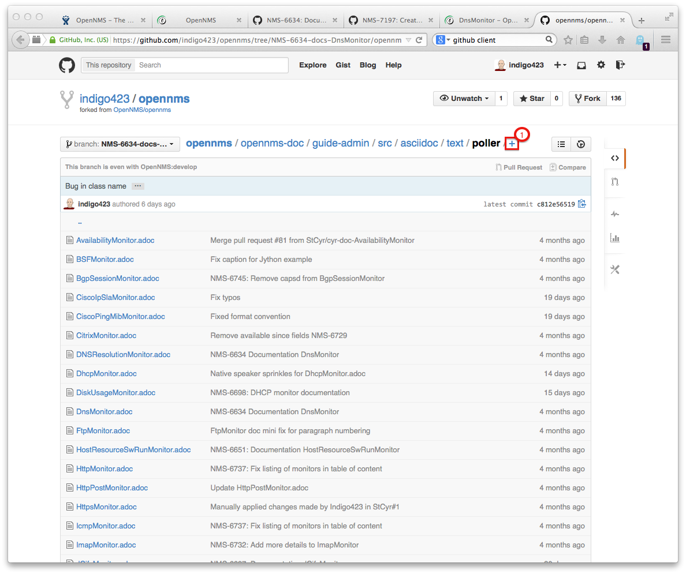

.Set a file name and create content and a commit message
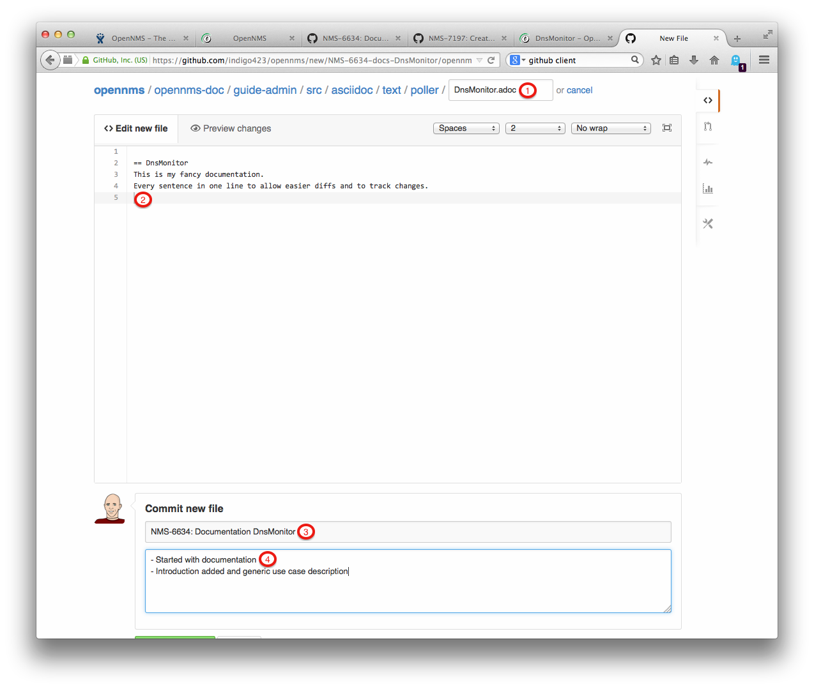

. File name to create in our case a new documentation file with the name 'DnsMonitor.adoc'
. Documentation in _AsciiDoc_ format
. Subject for the commit message with `NMS-<number>-docs-<Subject-without-spaces>`
. Short information about your change

You can commit the change directly online by clicking on _Commit changes_ on the bottom end of the page.

The next step is sending your changes to the official OpenNMS repository described in section <<guidedoc-gitflow-send-pull-request>>.

[[guidedoc-gitflow-send-pull-request]]
==== Send the Pull Request

If you have finished, it's time to create a _Pull Request_ to indicate your contribution should go in the official OpenNMS codebase.
Commit and push all your changes to your GitHub repository.
Create a _Pull Request_ from the GitHub web application with click on _Compare & pull request_.
The _Pull Request_ will be created automatically against the correct _develop_ branch.

.Click on _Compare & pull request_
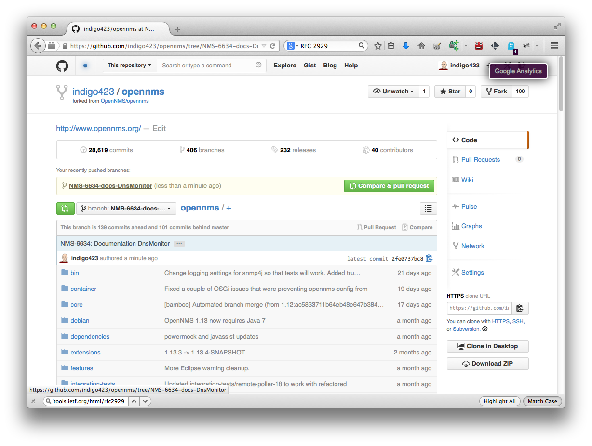

GitHub will use your last git commit message for the _Pull Request_.
Add to your commit message the following information:

----
JIRA: http://issues.opennms.org/browse/NMS-6634

Todo Review:
- [ ] Typo and grammar
- [ ] Formatting and conventions
- [ ] Content
----

This comment creates a review status indicator for the review.

.Create a review status indicator in your _Pull Request_ message
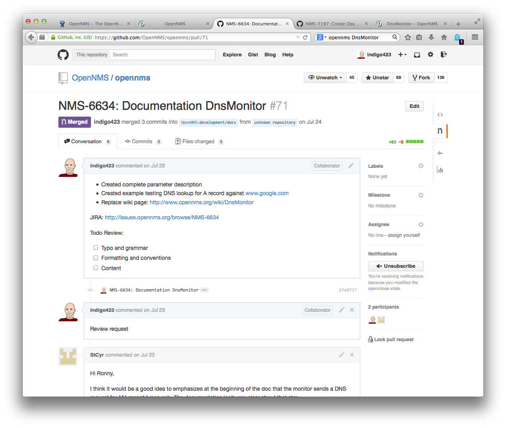

To indicate you need a review set a link for the _Pull Request_ in the JIRA issue.

.Create a link with a review request in the JIRA issue
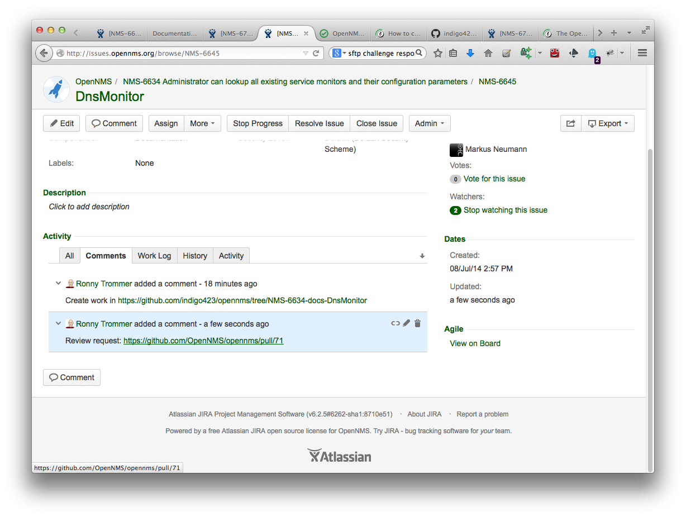

Reviewer can add annotations lines in your contributed changes.
You can work in this comments by just making your changes in your working branch, commit and push them to your repository.
GitHub will automatically add this commits to your pull requests.
If the status for _Content_, _Formatting and conventions_ and _Typo and grammar_ is finished, the _Pull Request_ will be merged to the official OpenNMS code base.

NOTE: You will be notified if a reviewer adds comments or request changes through the GitHub.

If your _Pull Request_ is merged you will be also notified and the status of your outstanding _Pull Request_ changes to status _Merged_ on your GitHub profile page.

.Status of pull requests is indicated on your GitHub profile page
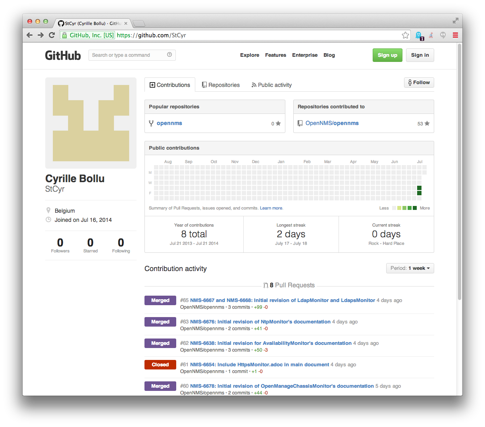

The OpenNMS Continuous Integration system based on _Bamboo_ picks up the merged pull request and starts a build and deploys a version with your changes automatically.
You can see the build jobs on the public available link:http://bamboo.internal.opennms.com:8085/allPlans.action[Bamboo system].
