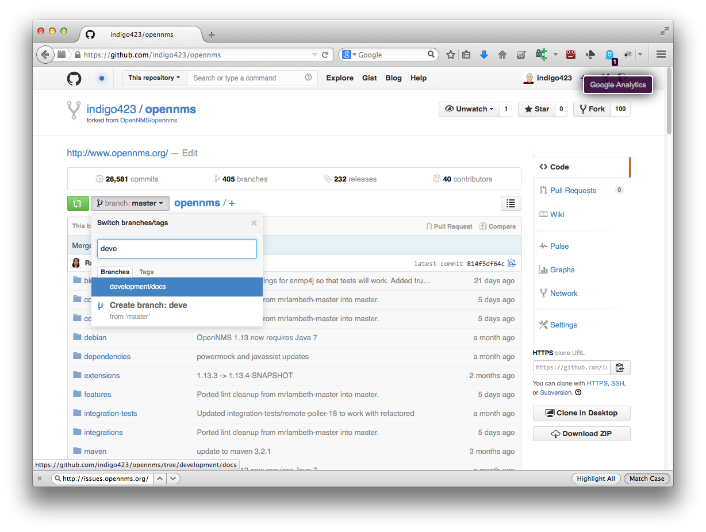
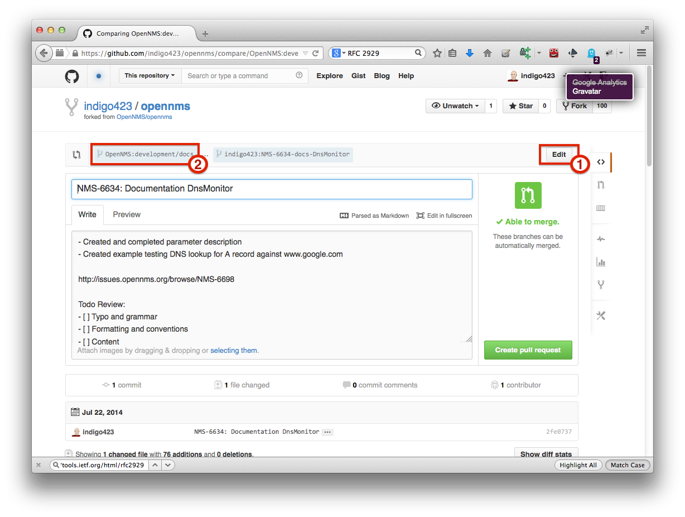
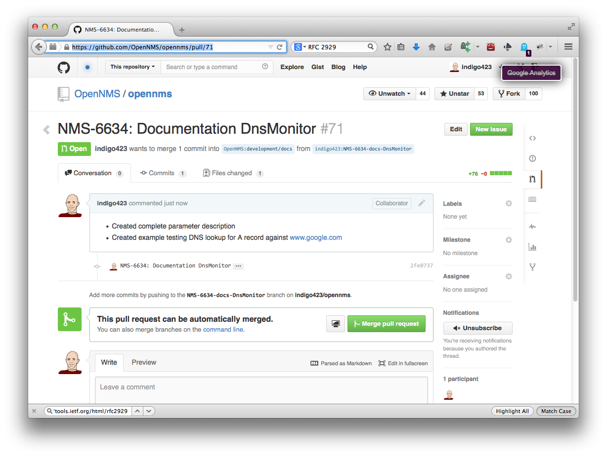
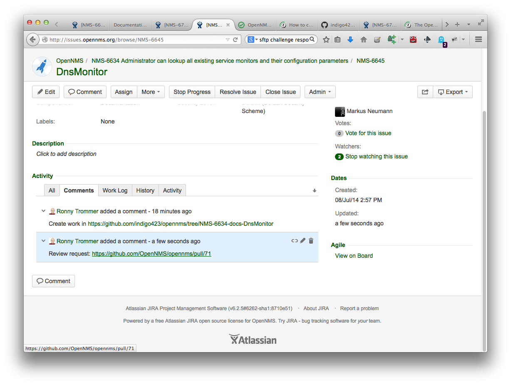
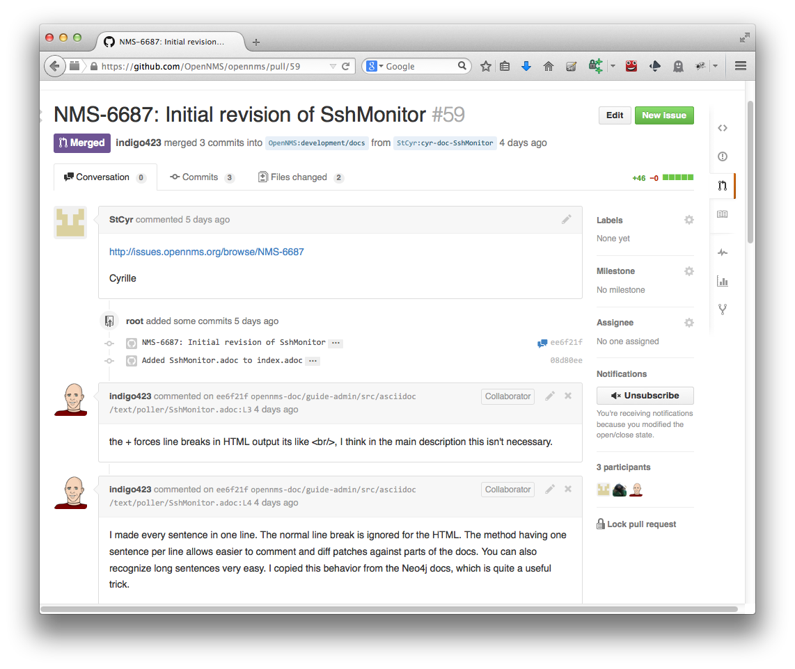

== JIRA and GitHub workflow
Every code contribution provided through pull requests should be driven by a JIRA issue.
JIRA is the main management tool to create and maintain releases for OpenNMS.
To make sure your contribution is tracked in the release management, you need first a JIRA issue for your pull requests.

It is required to have link:http://issues.opennms.org/secure/Signup!default.jspa[JIRA account] for creating and commenting issues and a link:https://github.com/join[GitHub account] for giving your contribution as pull request.

The following example describes a workflow how to contribute a documentation for the DnsMonitor.

The first step is to fork the OpenNMS project.
A guide how to fork a project on GitHub can be found on the GitHub help page link:https://help.github.com/articles/fork-a-repo[Fork a repository].

The second step is to pick the JIRA issue you want to work on.
The JIRA issue number is important to recognize the issue and is used as a reference.

.Pick the issue in JIRA you want to work on
image::../images/01_pick-issue.png[]

You can open a second browser tab and go to your GitHub account with your repositories.
Select your previously forked OpenNMS project and switch to the _development/docs_ branch.
You can use the input field autocompletion to find the branch.

.Switch to the development/docs branch

In the next step create a working branch for the JIRA issue you want to work with.
The name schema has the following pattern: +

_NMS-<number>-docs-<Subject-without-spaces>_

which is this example: _NMS-6634-docs-DnsMonitor_
This name is later used in the pull request and helps to identify the issue you want to work on.
You can just type in the name in the input field.
If the branch doesn't exist, GitHub will create it automatically for you.

.Create a working branch for the JIRA issue in your repository
image::../images/03_create-branch-from-dev-docs.png[]

If you want to work locally and you want to be able to work offline, you can clone your repository to you local computer with

 git clone https://github.com/<your-github-nick>/opennms.git

It will download the repository with all the branches to your local system in the 'opennms' directory.
By default you are in the _master branch_ of OpenNMS.
You can switch to your previously created working branch with the following command:

 git checkout -b NMS-6634-docs-DnsMonitor origin/NMS-6634-docs-DnsMonitor

Now you have your working branch where you can start your contribution.

.Your contribution and save it!
image::../images/04_your-contribution.png[]

After you finished your contribution in code or documentation it is time to save your work in your public GitHub repository.
The command

 git status

shows you which changes you maded regarding the last status from your checkout from the repository.
To add your changes to the version controlled history you have to add your changed files to the commit.
In our case we have created the 'DnsMonitor.adoc' file and it is shown as currently untracked in git.

The command

 git add DnsMonitor.adoc

adds this file for the next commit.

NOTE: The full path to the file to add depends on your current location in the file system.

.Add your created or modified files with git add.
image::../images/05_add-to-git.png[]

Write a comment which explains what you did.
The first line is used as a subject line and should contain the JIRA issue number and the JIRA issue subject.
After the subject keep one empty line and you can use bulletpoints to describe your changes

.Git comment with a subject line and bullet points for the description
image::../images/06_git-comment.png[]

You have now changed your local working copy and it is time to push the change to your GitHub repository with the following command

 git push

.Upload your changes to your GitHub repository
image::../images/07_git-push.png[]

Some times an issue isn't done in one day and take a longer period of time.
Give others the possibility to track the progress in your working branch by setting a link in the JIRA issue.
It indicates someone is already working on this issue and has to possibility to give you contribution as well.

.Set a link to your working branch if you've started your work
image::../images/08_link-to-working-branch.png[]

To get your contribution into the main code base of OpenNMS you have to create a _pull request_ from your working branch against the OpenNMS repository.

.Click on _Compare & pull request_
image::../images/09_compare-branches.png[]

The next dialog prepares your _pull request_ and you have to make sure you make the _pull request_ against the 'OpenNMS:development/docs' branch.
By default you will see _OpenNMS:master_, you can change the branch by click on _Edit_(1) and switch from _OpenNMS:master_ to _OpenNMS:development/docs_(2).
GitHub will use your last git commit message for the _pull request_ and you have a chance to add or change your commit message before sending the _pull request_.

.Switch target branch from OpenNMS:master to OpenNMS:development/docs

After you have clicked on the _Create pull request_ button, your _pull request_ is now queued for a review.

.Created pull request queued for review

To indicate you need a review set a link for the _pull request_ in the JIRA issue.

.Set a link for reviewing to the pull request in JIRA

Your _pull request_ will no be reviewed.
Reviewer can add annotations lines in your contributed changes.
You can work in this comments by just making your changes in your working branch, commit and push them to your repository.
GitHub will automatically add this commits to your pull requests.
The reviewer desides to merge your _pull request_ to the official OpenNMS repository.

.Example for a review on a _pull request_ for a contribution

A reviewer merges your _pull request_ to the official OpenNMS project.
The status is indicated on your GitHub profile page.

.Status of pull requests is indicated on your GitHub profile page
image::../images/14_merged-pull-request.png[]

The OpenNMS Continuous Integration system based on _Bamboo_ picks up the merged pull request and starts a build and deploys a version with your changes automatically.
You can see the build jobs on the public available link:http://bamboo.internal.opennms.com:8085/allPlans.action[Bamboo system].
