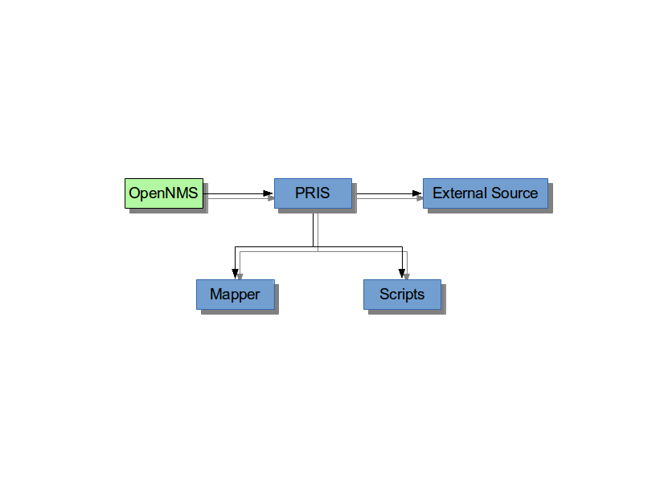

[[doc-guidelines-images]]
== Include images
Visualizing complex problems can help to explain much more information in an image.
We have in our documentation modules two directories for images.

The folder structure follows the included text structure.
In this case it is a little bit easier to locate the AsciiDoc text file where the image is included.

.Example folder structure for image files
[source]
----
.
└── opennms-doc<1>
    └── guide-doc<2>
        ├── README.adoc
        ├── pom.xml
        ├── src<3>
        |   └── asciidoc<4>
        |       ├── configs
        |       |   └── poller-configuration.xml
        |       ├── images<5>
        |       |   ├── 01_opennms-logo.png<6>
        |       |   └── 02_pris-overview.png
        |       ├── images_src<7>
        |       |   └── pris-overview.graphml<8>
        |       ├── index.adoc<9>
        |       └── text
        |           ├── images.adoc<10>
        |           ├── include-source.adoc
        |           ├── introduction.adoc
        |           └── writing.adoc
        └── target<11>
----
<1> Folder contains all documentation modules
<2> The module for this documentation for target group of documentation contributors
<3> Indicates a source folder
<4> Documentation root folder
<5> Folder for images as *.png or *.jpg and included in the documentation
<6> The image with leading a leading `<number>_` followed by a non-space name
<7> Some images are created from tools like _yED_, this folder should contain the editable version of the file with the same file name
<8> Editable version of the image source file
<9> Main document file which includes all documentation parts and is rendered as `index.html` for web representation
<10> AsciiDoc source file which can include images
<11> Target folder with generated HTML output after `mvn clean package`

IMPORTANT: All images in the entire manual share the same namespace.

To include an image file, make sure it resides at least in the 'images/' directory relative to the document you're including it from.
Then go:

.First included image
[source]
----
.This is a caption of the image
image::../images/01_opennms-logo.png[]
----

Which is rendered as:

.This is a caption of the image
image::../images/01_opennms-logo.png[]

.Second included image
[source]
----
.This is a caption of the image

----

Which is rendered as:

.This is a caption of the image

IMPORTANT: The image path is relative to the *.adoc source file, where you include the image.
