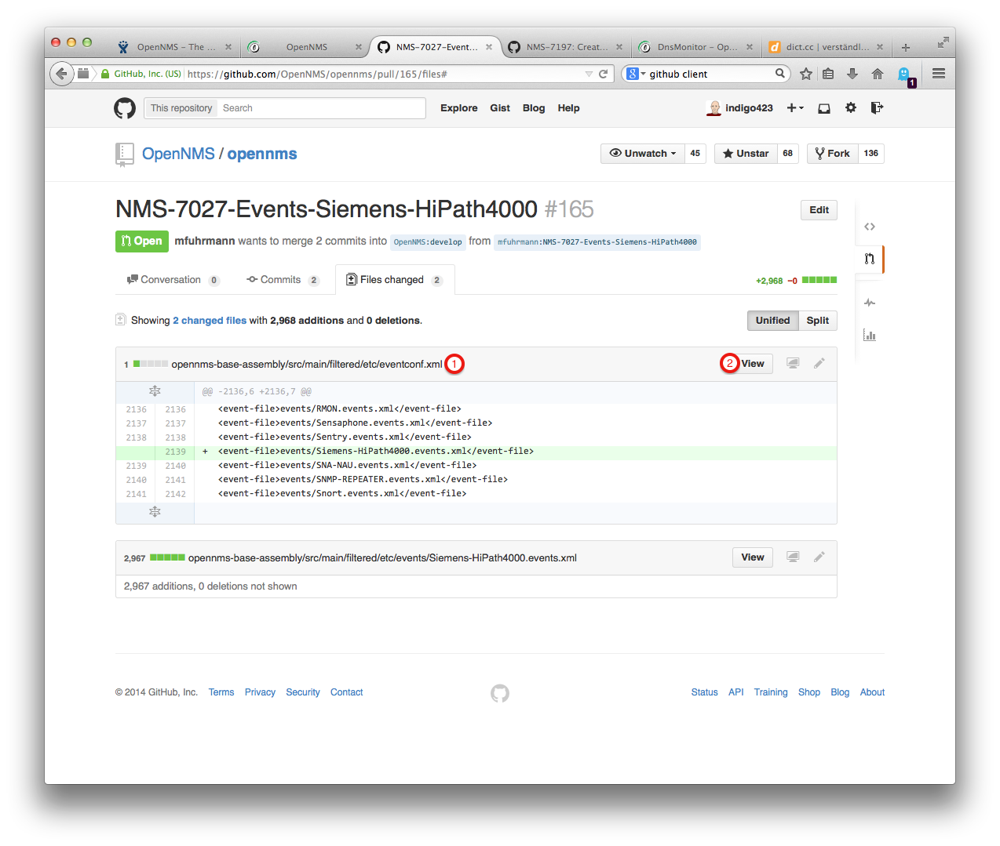
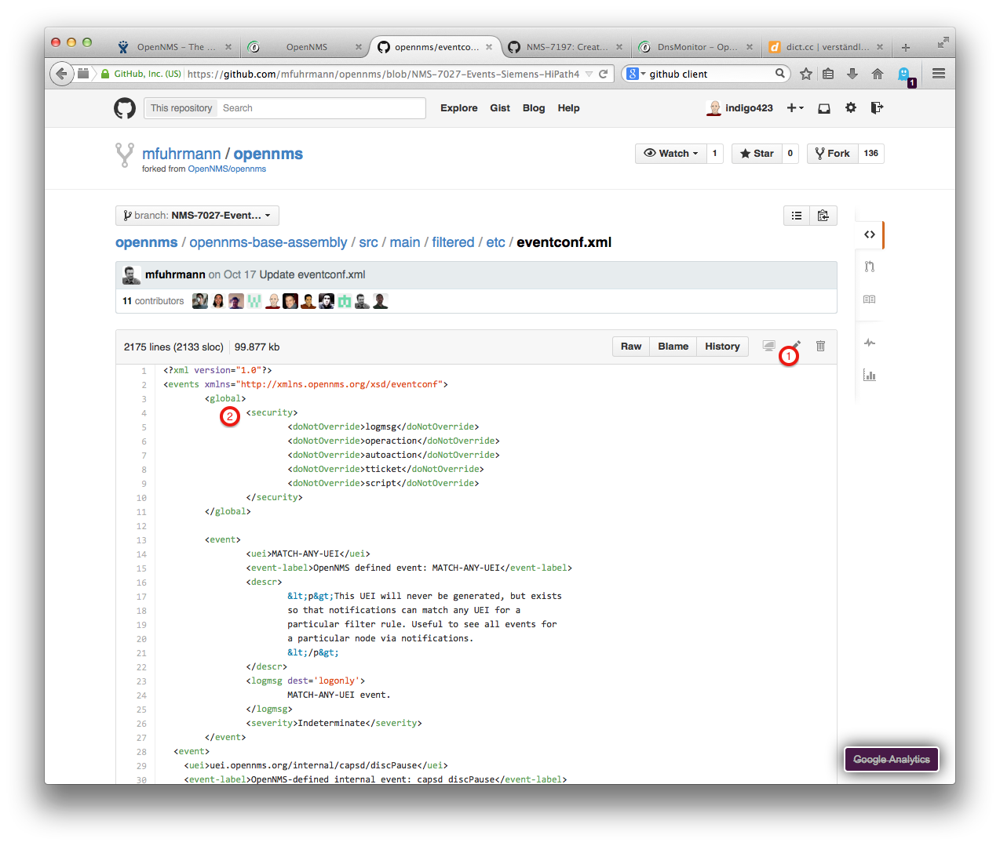
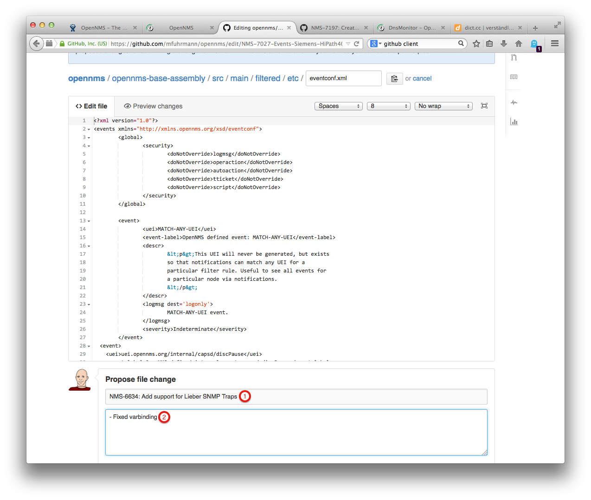
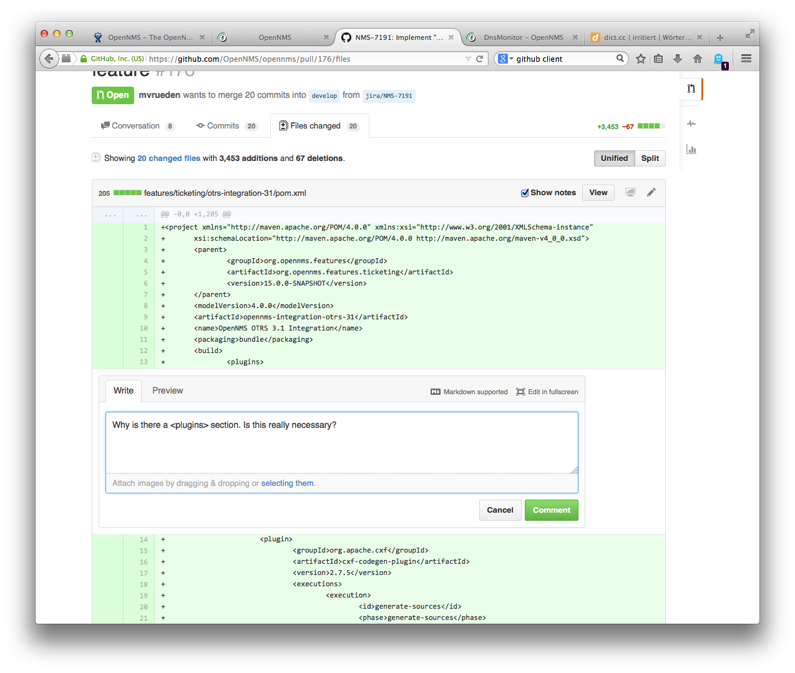

[[doc-guidelines-reviewing]]
== Review documentation

Reviews help to improve the quality of code or documentation.
As a reviewer keep in mind, you are looking in a result, somebody spent free time and effort in the contribution.
Treat contributions with respect.
Open _Pull Requests_ in the OpenNMS repository can be found here: https://github.com/OpenNMS/opennms/pulls.

A review for documentation is finished if _Type and grammar_, _Formatting and conventions_ and _Content_ are checked on the _Pull Request_.
_Pull Request_ are executed by elected community members _OGP_ or members of the OpenNMS Group.

You have the following possibilities reviewing a contribution:

* Everything is perfect and you there is no change necessary you can just merge the pull request and set the JIRA issue to status closed.
* There are changes necessary, in this case comment the lines in the pull request directly and follow up the conversation there.
* Bigger conceptual changes necessary or information out of reach for the contributor, you can provide a pull request back and give
  the contributor a change working your additional information in.
* Reject the pull request, cause it is not possible for any reason to get the code in the official code base.

The following sections describe the workflow for reviewing a pull request for documentation.

=== Formal check, is everything there

Every Pull Request should have in the first comment the following content:

* Comment with the back link to the JIRA issue and a Todo list for the review, see below

[source]
----
JIRA: http://issues.opennms.org/browse/NMS-6634

Todo Review:
- [ ] Typo and grammar
- [ ] Formatting and conventions
- [ ] Content
----

* The JIRA issue should be in status "Resolved"

=== Review criteria

. Check for typos and grammar, normally a native speaker can help here
. Check <<doc-guidelines-conventions, Conventions for text formatting>>
. Check if the contribution is complete and reasonable.
  You don't have to verify the documentation parts in local test environment.
. Check the marks for the steps you were able to finish.

NOTE: You can't know everything.
It will happen, somebody documents a behavior somebody doesn't know.
Don't hesitate to ask in the OpenNMS mailing list or IRC channels to clarify issues.
If nobody knows the correct behavior don't get blocked, make a warning note and merge it.
A bug can be created if the described behavior doesn't work.

=== Feedback

If you have two possibilities to give feedback on a _Pull Request_.
You can directly change the content or start a conversation using the annotation function in GitHub.

==== Change the content directly in GitHub.

You want to fix or add something directly in the document.
Go to the _Pull Request_ and select the register card _Files Changed_.

.Select the file to edit and click on _View_

. The file you want to edit.
. Select first _View_ to show the file content

WARNING: Don't be confused, the _Pen_ to edit isn't available at this place.
         You can just edit the file in the _View_ screenshot below.

.Make your changes and edit the file

. The _Pen_ icon is available, click to edit
. Change in the editor directly

.Save and commit your changes

It will create automatically a _Pull Request_ back to the author to accept your changes.
The author is notified with the GitHub notification.
The following two sections describe both options in detail.

==== Conversation with comments

Instead of changing the content directly, you can also start a conversation.
. Go to the _Pull Request_ and select _Files changed_.
. Click on _View_.
. If you use the mouse cursor, you'll see a blue plus icon behind the line number.
. Click on the _+_ icon and add your question or note and save with _Comment
. The author is notified through GitHub about your annotation and can give feedback.

=== Merge contribution to official code base

If all changes of the review are worked in, the _Pull Request_ can be merged by an elected community _OGP_ member.

. Merge the pull request
. Change JIRA status from _Resolved_ to _Closed_
. Check if the build in Bamboo and the deployment was ok
