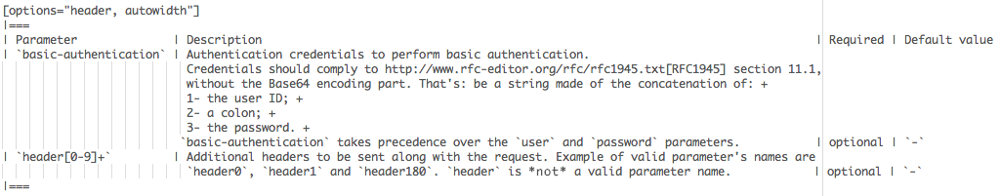

[[doc-guidelines-writing]]
== Writing

Put one sentence on each line.
This makes it easy to move content around, and also easy to spot (too) long sentences.
It helps also to assign comments on a sentence in GitHub and allows easier merging.

NOTE: Other than writing documentation, you can help out by providing comments about improvements or reporting bugs - head over to the http://issues.opennms.org/browse/NMS/component/10011[issue tracker for documentation] to do that!

[[doc-guidelines-conventions]]
=== Conventions for text formatting
To give the documentation a consistent layout the following conventions are used:

* File names and path is written in `'poller-configuration.xml'` and will be rendered as: 'poller-configuration.xml'
* Names which indicates special attention, e.g. this configuration matches \*any* entry: which is rendered as: this configuration matches *any* entry
* \_Italics_ is rendered as _Italics_ and used for emphasis and indicate internal names and abbreviations.
* \*Bold* is rendered as *Bold* and used sparingly, for strong emphasis only.
* \+methodName()+ is rendered as +methodName()+ and is used for literals as well
  (note: the content between the `+` signs _will_ be parsed).
* \`command` is rendered as `command` (typically used for command-line or parts used in configuration files)
  (note: the content between the +`+ signs _will not_ be parsed).
* Mono\+\+space\++d is rendered as Mono++space++d and is used for monospaced letters.
* \'my/path/' is rendered as 'my/path/' which is used for file names and paths.
* \\``Double quoted'' (that is two grave accents to the left and two acute accents to the right) renders as ``Double quoted''.
* \`Single quoted' (that is a single grave accent to the left and a single acute accent to the right) renders as `Single quoted'.

[[doc-guidelines-gotchas]]
=== Gotchas

* Always leave a blank line at the top of the documents section.
It might be the title ends up in the last paragraph of the document
* Always leave a blank line at the end of documents
* As +{}+ are used for Asciidoc attributes, everything inside will be treated as an attribute.
  What you have to do is to escape the opening brace: +\\{+.
  If you don't, the braces and the text inside them will be removed without any warning being issued!
* Forcing line breaks can be achieved with ` +` at the end of the line followed by a line break

.Example in source force line break
[source]
----
This is the first line +
and this a forced 2nd line
----

.Rendered output with forced line break
This is the first line +
and this a forced 2nd line

== Headings and document structure

Each document starts over with headings from level zero (the document title).
Each document should have an id.
In some cases sections in the document need to have id's as well, this depends on where they fit in the overall structure.
To be able to link to content, it has to have an id. Missing id's in mandatory places will fail the build.

This is how a document should start:

[source]
----
[[unique-id-verbose-is-ok]]
= The Document Title
----

To push the headings down to the right level in the output, the +leveloffset+
attribute is used when including the document inside of another document.

Subsequent headings in a document should use the following syntax:

[source]
----
== Subheading

... content here ...

=== Subsubheading

content here ...

----

[[doc-guidelines-links]]
== Links

To link to other parts of the manual the id of the target is used.
This is how such a reference looks:

[source]
----
<<doc-guidelines-links>>
----

Which will render like: <<doc-guidelines-links>>

[NOTE]
Just write "see \<<target-id>>" and similar, that should suffice in most cases.

If you need to link to another document with your own link text, this is what to do:

[source]
----
<<target-id, link text that fits in the context>>
----

NOTE: Having lots of linked text may work well in a web context but is a pain in print, and we aim for both!

External links are added like this:

[source]
----
http://www.opennms.org/[Link text here]
----

Which renders like: http://www.opennms.org/[Link text here]

For short links it may be better not to add a link text, just do:

[source]
----
http://www.opennms.org/
----

Which renders like: http://www.opennms.org/

NOTE: It's ok to have a dot right after the URL, it won't be part of the link.

[[doc-guideline-admonitions-notes]]
== Admonitions and usefull notes

These are very useful and should be used where appropriate.
Choose from the following (write all caps and no, we can't easily add new ones):

.Source template for making a note for additional hints
[source]
----
NOTE: This is my note.
----

This is how its rendered:

NOTE: This is my note.

.Source for giving a tip
[source]
----
TIP: This is my tip.
----

This is how its rendered:

TIP: This is my tip.

.Source for giving a important hint
[source]
----
IMPORTANT: This is my important hint.
----

This is how its rendered:

IMPORTANT: This is my important hint.

.Source for giving a caution
[source]
----
CAUTION: This is my caution.
----

This is how its rendered:

CAUTION: This is my caution.

.Source for giving a warning
[source]
----
WARNING: This is my warning.
----

This is how its rendered:

WARNING: This is my warning.

A multiline variation:

[source]
----
[TIP]
Tiptext. +
Line 2.
----

Which is rendered as:

[TIP]
Tiptext. +
Line 2.

== Attributes

Common attributes you can use in documents:

* \{opennms-version} - rendered as "{opennms-version}"

These can substitute part of URLs that point to for example APIdocs or source code.
Note that opennms-git-tag also handles the case of snapshot/master.

Sample Asciidoc attributes which can be used:

* \{docdir} - root directory of the documents
* \{nbsp} - non-breaking space

== Comments

There's a separate build including comments.
The comments show up with a yellow background.
This build doesn't run by default, but after a normal build, you can use `make annotated` to build it.
You can also use the resulting page to search for content, as the full manual is on a single page.

Here's how to write a comment:

[source]
----
// this is a comment
----

The comments are not visible in the normal build.
Comment blocks won't be included in the output of any build at all.
Here's a comment block:

[source]
----
////
Note that includes in here will still be processed, but not make it into the output.
That is, missing includes here will still break the build!
////
----

== Tables
Structuring information you can use tables.
A table is build with the following structure

[source]
----
[options="header, autowidth"]
|===
| Parameter     | Description                | Required | Default value
| `myFirstParm` | my first long description  | required | `myDefault`
| `myScndParm`  | my second long description | required | `myDefault`
|===
----

Which is rendered as

[options="header, autowidth"]
|===
| Parameter     | Description                | Required | Default value
| `myFirstParm` | my first long description  | required | `myDefault`
| `myScndParm`  | my second long description | required | `myDefault`
|===

NOTE: Please align columns in the AsciiDoc source to give better readability.
If you have a very long description, break at 120 and allign the text to improve source readability.

.Example in AsciiDoc source for very long table descriptions

which is rendered as:

[options="header, autowidth"]
|===
| Parameter              | Description                                                                                 | Required | Default value
| `basic-authentication` | Authentication credentials to perform basic authentication.
                           Credentials should comply to http://www.rfc-editor.org/rfc/rfc1945.txt[RFC1945] section 11.1,
                           without the Base64 encoding part. That's: be a string made of the concatenation of: +
                           1- the user ID; +
                           2- a colon; +
                           3- the password. +
                          `basic-authentication` takes precedence over the `user` and `password` parameters.           | optional | `-`
| `header[0-9]+`         | Additional headers to be sent along with the request. Example of valid parameter's names are
                           `header0`, `header1` and `header180`. `header` is *not* a valid parameter name.            | optional | `-`
|===
