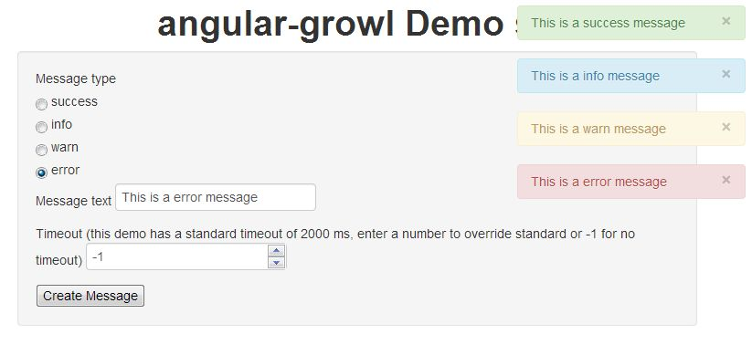

#angular-growl-2
Growl like notifications for angularJS projects, using bootstrap alert classes, originally developed by Marco Rinck

##Features



* growl like notifications like in MacOS X
* using standard bootstrap classes (alert, alert-info, alert-error, alert-success)
* global or per message configuration of a timeout when message will be automatically closed
* automatic translation of messages if [angular-translate](https://github.com/PascalPrecht/angular-translate) filter is
present, you only have to provide keys as messages, angular-translate will translate them
* pre-defined $http-Interceptor to automatically handle $http responses for server-sent messages
* automatic CSS animations when adding/closing notifications (only when using >= angularJS 1.2)
* < 1 kB after GZIP
* Allows for HTML content inside the alert
* Possible to use multiple growl directives that show their notification inline
* Icons for the different alert types (can be disabled)
* Possible to set an optional title
* Server side variable interpolation
* Lots of configuration possible!

##Installation

You can install angular-growl-v2 with bower:

> bower install angular-growl-v2

Alternatively you can download the files in the [build folder](build/) manually and include them in your project.

````html
<html>
  <head>
    <link href="bootstrap.min.css" rel="stylesheet">
    <script src="angular.min.js"></script>

    <link href="angular-growl.css" rel="stylesheet">
    <script src="angular-growl.js"></script>
  </head>
</html>
````

As angular-growl is based on its own angularJS module, you have to alter your dependency list when creating your application
module:

````javascript
var app = angular.module('myApp', ['angular-growl']);
````

Finally, you have to include the directive somewhere in your HTML like this:

````html
<body>
    <div growl></div>
</body>
````

##Usage

Just let angular inject the growl Factory into your code and call the 4 functions that the factory provides accordingly:

````javascript
app.controller("demoCtrl", ['$scope', 'growl', function($scope, growl) {
  $scope.addSpecialWarnMessage = function() {
    growl.warning("This adds a warn message");
    growl.info("This adds a info message");
    growl.success("This adds a success message");
    growl.error("This adds a error message");
  }
}]);
````

The title must be set as a configuration parameter:

````javascript
app.controller("demoCtrl", ['$scope', 'growl', function($scope, growl) {
  $scope.addSpecialWarnMessage = function() {
    growl.warning("This adds a warn message", {title: 'Warning!'});
    growl.info("This adds a info message", {title: 'Random Information'});
    growl.success("This adds a success message"); //no title here
    growl.error("This adds a error message", {title: 'ALERT WE GOT ERROR'});
  }
}]);
````

If [angular-translate](https://github.com/PascalPrecht/angular-translate) is present, its filter is automatically called for translating of messages, so you have to provide
only the key:

````javascript
app.controller("demoCtrl", ['$scope', 'growl', function($scope, growl) {
  $scope.addSpecialWarnMessage = function() {
      growl.success("SAVE_SUCCESS_MESSAGE");
      growl.error("VALIDATION_ERROR");
  }
}]);
````

## Configuration/Documentation/Info
For the configuration options, documentation and live examples visit the github pages:

## [http://janstevens.github.io/angular-growl-2/](http://janstevens.github.io/angular-growl-2/)

Live demo's can be found on the following codepen collection:

## [Codepen Collection](http://codepen.io/collection/Jhcpi/)

##Changelog
**0.8.0** - TBE TODO
* Code clean up
* Testing
* Latest angular support
* [Finding a solution for this issue](https://github.com/JanStevens/angular-growl-2/issues/54)

**0.7.2** - 20 Nov 2014
* Possibility to toggle the translation of messages (@schoes) [pull #55](https://github.com/JanStevens/angular-growl-2/pull/55)
* Check if the response is undefined (Offline Connections) (@brunoporto) [pull #50](https://github.com/JanStevens/angular-growl-2/pull/50)
* Prevent NPEs when working with server-side messages (@madhead) [pull #45](https://github.com/JanStevens/angular-growl-2/pull/45)
* Added a general method for setting the Growl type based on a server response (@madhead) [pull #41](https://github.com/JanStevens/angular-growl-2/pull/41)
* Split Growl directive in a growl factory added a way to programatically close messages and a setText to update the message text (@chasemgray) [pull #38](https://github.com/JanStevens/angular-growl-2/pull/38)

**0.7.0** - 10 Aug 2014
* Added new documentation website with examples instead of this readme.
* Growl Containers are now responsive for mobile devices (@tlvince) [pull #17](https://github.com/JanStevens/angular-growl-2/pull/17)
* Add option to reverse order of messages (@MilosMosovsky) [pull #18](https://github.com/JanStevens/angular-growl-2/pull/18)
* Add option to set the message limit of a growl container (@MilosMosovsky) [pull #21](https://github.com/JanStevens/angular-growl-2/pull/21)
* Add new feature to stop the TTL when clicked and remove the message manually when clicked again (@willjk) [pull #27](https://github.com/JanStevens/angular-growl-2/pull/27)
* Fix for issue #22 (@soumya92) [pull #23](https://github.com/JanStevens/angular-growl-2/pull/23)
* Fix for angular 1.3 http interceptor API changes (@vik-singh) [pull #20](https://github.com/JanStevens/angular-growl-2/pull/20) & [pull #29](https://github.com/JanStevens/angular-growl-2/pull/29)
* Fix only add template to cache if it doesn't exist already (@Anaphase) [pull #31](https://github.com/JanStevens/angular-growl-2/pull/31)

**0.6.1** - 25 May 2014
* Fixes edge case where message test is not a string
* Fixes style issue where close button was floating outside the alert
* Fixes issue [#12](https://github.com/JanStevens/angular-growl-2/issues/12), [#15](https://github.com/JanStevens/angular-growl-2/issues/15), [#16](https://github.com/JanStevens/angular-growl-2/issues/16)

**0.6.0** - 16 Apr 2014
* [CHANGE] remove enableHtml, `$sce.trustAsHtml` is always run on the message text
* Possible to set global possition for non-inline growl messages (thanks @pauloprea)
* Template can now easily be replace or styled with CSS
* Include icons for the different notifications, can be disabled globally or per notification
* Server side messages can now interpolate variables into the message ([original pull request](https://github.com/marcorinck/angular-growl/pull/19))


**0.5.3** - 19 Mar 2014
* Fixed bug where globalInlineMessage option would not work globally

**0.5.2** - 19 Mar 2014
* Added an option to show notifications inline instead of growl like behaviour (very handy for forms)
* Added a referenceId field so different inline growl directives can be targeted
* Converted tabs to spaces
* Updated the demo site to show the new changes

**0.5.0** - 18 Mar 2014
* Manually merged some pull requests from the original branch
* Fixed bower.json file to include itself and the css file
* [BREAK] changed the function names to add growl notifications to be a shorter (success, info, warning, error VS addSuccessMessage, addInfoMessage...)

**0.4.0** - 19th Nov 2013

* updated dependency to angularJS 1.2.x, angular-growl does not work with 1.0.x anymore (BREAKING CHANGE)
* new option: only display unique messages, which is the new default, disable to allow same message more than once (BREAKING CHANGE)
* new option: allow html tags in messages, default is off  you need to

**0.3.1** - 1st Oct 2013

* bugfix: translating of messages works again
* change: also set alert css classes introduced by bootstrap 3

**0.3.0** - 26th Sept 2013

* adding css animations support via ngAnimate (for angularJS >= 1.2)
* ability to configure server message keys

**0.2.0** - 22nd Sept 2013

* reworking, bugfixing and documenting handling of server sent messages/notifications
* externalizing css styles of growl class
* provide minified versions of js and css files in build folder

**0.1.3**  - 20th Sept 2013

* introducing ttl config option, fixes #2

## Contributions
* Fork the project
* Change/Fix/Add the stuff you want
* Clone the codepens that have effect on your changes or if you add new features create a codepen that show them
* Create a PR
* Don't forget to add your name to the Thanks section!

# Thanks
Thanks Marco Rinck for the original code, the following people have contributed to this project:

* [orangeskins](https://github.com/orangeskins)
* [adamalbrecht](https://github.com/adamalbrecht)
* [m0ppers](https://github.com/m0ppers)
* [lbehnke](https://github.com/lbehnke)
* [rorymadden](https://github.com/rorymadden)
* [pauloprea](https://github.com/pauloprea)
* [tlvince](https://github.com/tlvince)
* [vik-singh](https://github.com/vik-singh)
* [Anaphase](https://github.com/Anaphase)
* [soumya92](https://github.com/soumya92)
* [willjk](https://github.com/willjk)

# License
Copyright (C) 2014 Marco Rinck

Permission is hereby granted, free of charge, to any person obtaining a copy of this software and associated documentation files (the "Software"), to deal in the Software without restriction, including without limitation the rights to use, copy, modify, merge, publish, distribute, sublicense, and/or sell copies of the Software, and to permit persons to whom the Software is furnished to do so, subject to the following conditions:

The above copyright notice and this permission notice shall be included in all copies or substantial portions of the Software.

THE SOFTWARE IS PROVIDED "AS IS", WITHOUT WARRANTY OF ANY KIND, EXPRESS OR IMPLIED, INCLUDING BUT NOT LIMITED TO THE WARRANTIES OF MERCHANTABILITY, FITNESS FOR A PARTICULAR PURPOSE AND NONINFRINGEMENT. IN NO EVENT SHALL THE AUTHORS OR COPYRIGHT HOLDERS BE LIABLE FOR ANY CLAIM, DAMAGES OR OTHER LIABILITY, WHETHER IN AN ACTION OF CONTRACT, TORT OR OTHERWISE, ARISING FROM, OUT OF OR IN CONNECTION WITH THE SOFTWARE OR THE USE OR OTHER DEALINGS IN THE SOFTWARE.
