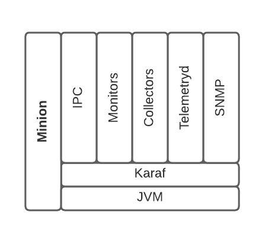
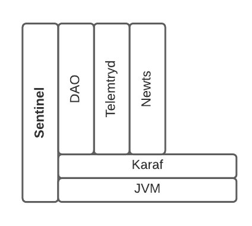

# OpenNMS 2.0

## Motivation

Let's reassess the architecture of the stack and the different runtimes with the aim of:
* Improving the developer experience
* Improving the resiliency and scalability of the platform (cloud-ready)
* Reducing technical debt associated with the diverse technologies and aged libraries

## Current state

There are currently 3 different runtimes in the stack:

**Core** is the original bootstrap that runs the majority of the services and business logic.

**Minion** acts as the "eyes and ears" on the remote networks and interacts with the elements.

**Sentinel** helps scale particular workloads from the core.

The Core is based on a custom bootstrap which uses Spring for the bulk of the wiring and embeds Jetty, Karaf and ActiveMQ.

The Minion and Sentinel are custom Karaf distributions.

### Core

### Minion

### Sentinel

See [SENTINEL](SENTINEL.md) for more information on the Sentinel runtime.

## Recommendations

### Leverage the Karaf runtime

We want to standardize on using Karaf as the base distribution and move away from the custom bootstrap currently used by the Core.

This will allow us to take full advantage of the modularity of OSGi and the Karaf ecosystem.

This will also allow us to reduce technical debt and complexity of the solution - there are may pain points associated with different forms of wiring and classloader issues related to running Karaf inside the Core.

## Remaining Uncertainties

### Target Maven tree structure

How do we want to organize the tree?

Review artifactId:groupIds

### Karaf feature structure

What can users install and choose from?

### Wiring

OSGi annotations (R7) vs Blueprint syntax?

### Integration testing

Heavily tied to Spring currently

Whitebox with mocks (no database, or filesystem access)

Blackbox with containers
