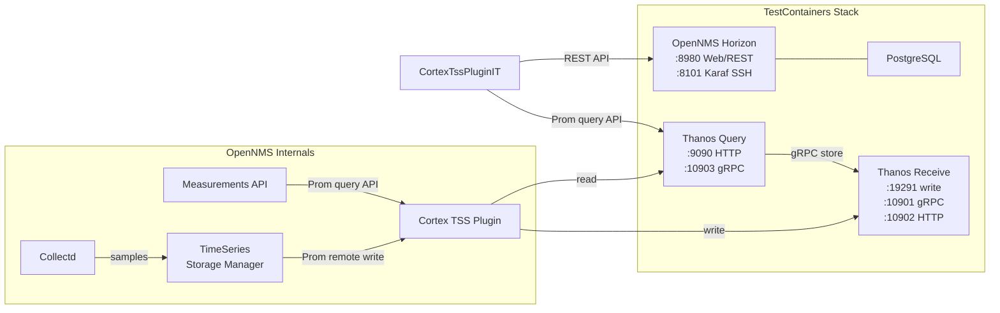

# OpenNMS System Tests

These tests are used as part of the CI pipeline to perform end-to-end tests on OpenNMS and the related components.
We currently leverage Docker and the TestContainers framework for running the suites.


## Running the system tests manually

### Getting the Docker Images
The tests require Docker images to run. There are two alternatives to get them, a) or b):

#### a) Pull existing images from DockerHub

You can pull existing images down with:
```
export VERSION=XX.X.X
docker pull opennms/horizon:$VERSION
docker pull opennms/minion:$VERSION
docker pull opennms/sentinel:$VERSION
```

> Update the tag to match the system tests your running

And then tag them for the tests:
```
export VERSION=XX.X.X
docker tag opennms/horizon:XX.X.X opennms/horizon
docker tag opennms/minion:XX.X.X opennms/minion
docker tag opennms/sentinel:XX.X.X opennms/sentinel
```

### b) Pull images from build artifacts

```
wget https://raw.githubusercontent.com/OpenNMS/opennms-repo/master/script/download-artifacts.pl
cpan DateTime::Format::ISO8601 HTTP::Request JSON::PP LWP LWP::Protocol::https URI::Escape
perl download-artifacts.pl oci <branch-name>
docker image load -i horizon.oci
docker image load -i minion.oci
docker image load -i sentinel.oci
```

### Run the tests

Once the containers are available, you can run the tests using:
```
cd smoke-test
mvn -DskipITs=false integration-test
```
**Hint for running on OSX**

It's very likely you will get the following error message:

```
Caused by: com.github.dockerjava.api.exception.DockerException: Mounts denied:
The path /var/folders/cj/_yzj5k7d6d11gl5frcn2yqhh0000gn/T/opennms690045176960825494/
is not shared from OS X and is not known to Docker.
You can configure shared paths from Docker -> Preferences... -> File Sharing.
See https://docs.docker.com/docker-for-mac/osxfs/#namespaces for more info.
```

To fix this issue you have change the tmpdir path for Java with:

```
mvn -DskipITs=false integration-test -Djava.io.tmpdir=/tmp
```

### Run tests from local Docker image

If you have the code compiled and assembled locally, you can use the tarball build for container images, so you don't have to wait for the CI/CD to download the container image artifact.
In `opennms-container/horizon` run `make` to create `opennms/horizon:latest` in your local Docker image repo.
Smoke tests will run against this image in your local Docker image repo.
When you want to use the latest **published** Horizon docker image, make sure to remove the local image with `docker image rm opennms/horizon:latest`.
You can do the same for the Minion and Sentinel.

## Time Series Strategy: INTEGRATION

The smoke test infrastructure supports pluggable time series storage (TSS) backends via `TimeSeriesStrategy.INTEGRATION`. This enables end-to-end testing of TSS plugins (e.g., the Cortex TSS plugin) with real Prometheus-compatible backends.

### Architecture



### Data Flow

1. **Write path**: OpenNMS Collectd collects JVM/DB/SNMP metrics every 30s (self-monitor node) -> `TimeseriesStorageManager` -> Cortex TSS plugin -> Prometheus remote write to Thanos Receive
2. **Read path**: Test queries OpenNMS Measurements API -> Cortex TSS plugin -> Prometheus query API on Thanos Query -> data returned through OpenNMS REST response

### Prerequisites

The Cortex TSS plugin is built separately from OpenNMS. You need the plugin KAR file before running these tests.

```bash
# 1. Clone and build the plugin
git clone https://github.com/OpenNMS/opennms-cortex-tss-plugin.git
cd opennms-cortex-tss-plugin
mvn clean install -DskipTests

# 2. Run the smoke tests with the KAR path
cd /path/to/opennms
./compile.pl -t -Dsmoke -Dsmoke.flaky \
    -Dcortex.kar=/path/to/opennms-cortex-tss-plugin/assembly/kar/target/opennms-cortex-tss-plugin.kar \
    --projects :smoke-test install

# Alternative: bind-mount your entire Maven repo into the container
./compile.pl -t -Dsmoke -Dsmoke.flaky \
    -Dorg.opennms.dev.m2=$HOME/.m2/repository \
    --projects :smoke-test install
```

### Container Setup

```java
@ClassRule
public static OpenNMSStack stack = OpenNMSStack.withModel(StackModel.newBuilder()
        .withTimeSeriesStrategy(TimeSeriesStrategy.INTEGRATION)
        .withOpenNMS(OpenNMSProfile.newBuilder()
                .withInstallFeature("opennms-plugins-cortex-tss", "opennms-cortex-tss-plugin")
                .build())
        .build());
```

This wires up:
- **ThanosReceiveContainer** (write endpoint) and **ThanosQueryContainer** (read endpoint) in the RuleChain
- Cortex plugin config (`org.opennms.plugins.tss.cortex.cfg`) pointing at the Thanos containers
- `org.opennms.timeseries.strategy=integration` in system properties
- `opennms-timeseries-api` feature in Karaf boot

### Validation Utilities

`TimeSeriesValidationUtils` provides strategy-agnostic validation methods reusable with any TSS backend:

- `validateResourceTree(restClient, nodeCriteria)` — verifies the resource tree is populated with child resources
- `validateMeasurements(restClient, resourceId, attribute, aggregation)` — verifies data round-trips through the measurements API
- `validateMeasurementsMetadata(restClient, resourceId, attribute)` — verifies measurement metadata (node labels, resource info)

### Available Containers

| Container | Class | Default Ports | Purpose |
|-----------|-------|---------------|---------|
| Thanos Receive | `ThanosReceiveContainer` | 19291 (write), 10901 (gRPC), 10902 (HTTP) | Accepts Prometheus remote write |
| Thanos Query | `ThanosQueryContainer` | 9090 (HTTP), 10903 (gRPC) | Prometheus-compatible query API |
| Prometheus | `PrometheusContainer` | 9090 (HTTP) | Standalone building block (not used by default INTEGRATION stack) |

## Writing system tests

When writing a new test, use the stack rule to setup the environment:
```
@ClassRule
public static final OpenNMSStack stack = OpenNMSStack.withModel(StackModel.newBuilder()
  .withMinion()
  .withSentinel()
  .withElasticsearch(true)
  .withIpcStrategy(IpcStrategy.JMS)
  .build());
```

Once the setup is complete and the tests are given control, you can interact with the services using:
```
@Test
public void testSomeFeature() {
  OpenNMSRestClient rest = stack.opennms().getRestClient();
  InetSocketAddress karaf = stack.opennms().getSshAddress();
  InetSocketAddress flowIngressUdp = stack.minion().getFlowTelemetryAddress();
  String elasticHttp = stack.elastic().getHttpHostAddress();
}
```

Make sure the tests your write are resilient and take caution to ensure that they do not flap.
If you find yourself having to wait for something to happen asynchronously, use `await()`:
```
await().atMost(timeoutMins, MINUTES)
                        .pollInterval(5, SECONDS).pollDelay(0, SECONDS)
                        .ignoreExceptions()
                        .until(nmsRestClient::getDisplayVersion, notNullValue());
```

### Patching .jars

If a test is failing and we have a patched .jar we want to deploy, how can we re-deploy it?

#### OSGi

1. Link m2s by setting `-Dorg.opennms.dev.m2=/home/jesse/.m2/repository`
2. Set a breakpoink in the test before the exercised feature is used and re-run it in debug mode
3. Reload the bundles in Karaf using: `bundle:watch *`

#### Filesystem

Locate the target path of the .jar: `/opt/opennms/lib/opennms-services-XX.X.X-SNAPSHOT.jar`

Add the .jar to the overlay:
```
OVERLAY_ROOT="~/git/opennms/smoke-test/src/main/resources/opennms-overlay"
TARGET_PATH="$OVERLAY_ROOT/lib"
mkdir -p $TARGET_PATH
cp target/opennms-services-XX.X.X-SNAPSHOT.jar $TARGET_PATH/lib
```

Re-run the test.

> Remove it from the overlay before checking the code in.

### Selenium tests

#### Testing against your local instance

If you would like to start writing tests against UI changes that you have running in a local instance, you can configure the Selenium tests to use this instance on the host, rather than using the one created in the containers.
To set this up, start by spawning the browser as a container once by running the `main()` method in the `OpenNMSSeleniumDebugIT` class.
Once the environment is ready, you should see output similar to:
```
Web driver is available at: http://localhost:32811/wd/hub
OpenNMS is available at: http://localhost:32808/
```

You can then update your class like so:
```
public class MenuHeaderIT extends OpenNMSSeleniumDebugIT {
  public MenuHeaderIT() {
    super("http://localhost:32811/wd/hub");
  }
  ...

```

Now re-run the tests with `-Dorg.opennms.dev.container.host=172.17.0.1` set.
Update the host to be something that the Selenium container can use to reach your OpenNMS instance at `0.0.0.0:8980`.
In this case, I used to the IP address from the `docker0` interface.

#### Speeding up iterations

Selenium tests can get finicky and going through the setup and tear down for each test run can get time consuming.
In order to speed up development time, you can setup the environment once by running the `main()` method in the `OpenNMSSeleniumDebugIT` class.
This method uses the same bootstrap/setup code as the standard Selenium tests do.
Once the environment is ready, you should see output similar to:
```
Web driver is available at: http://localhost:32811/wd/hub
OpenNMS is available at: http://localhost:32808/
```

You can then update your class like so:
```
public class MenuHeaderIT extends OpenNMSSeleniumDebugIT {
  public MenuHeaderIT() {
    super("http://localhost:32811/wd/hub", "http://localhost:32808/");
  }
  ...

```

Running the test will now use the pre-built environment instead of creating a new one each time.
Once your happy with the test, stop the `main()` method, update the class to extend `OpenNMSSeleniumIT` instead and run it again for validation.

#### VNC access

The Selenium container that is spawned by the tests provides a VNC server which can be used to view and interact with the browser.
In order to connect, first find which port the server is bound to:
```
$ docker ps | grep selenium
6141e891d723        selenium/standalone-firefox-debug:3.141.59   "/opt/bin/entry_po..."   5 minutes ago       Up 5 minutes        0.0.0.0:33021->4444/tcp, 0.0.0.0:33020->5900/tcp                                                                                                                                                                                                          gallant_bhaskara
```

> In this case port 5900 is bound to 33020 locally

Connect using `vncviewer`:
```
$ vncviewer 127.0.0.1:33020
```

When prompted, the password is: `secret`

### Development Guidelines

1. Add your test to an existing class if you can.
This saves the CI system from having to spawn another stack which takes time to initialize.
2. If you find yourself having to customize the install to test new functionality, consider just always turning it on.
3. If the tests depend on new services provided by additional containers, consider adding a flag to help minimize the footprint of every stack.
4. If your sending UDP packets to drive tests, don't expect zero packet loss. This tends to cause flapping tests.

## Resource Usage

The "machine" image we use on CircleCI is currently limited to 2 vCPUs and 8GB of RAM, so we need to be careful with our memory usage for the tests to run reliably.

Breakdown of the heap sizes for the various containers currently is:
* Maven JVM: 1G
* Test JVM: 1G
* OpenNMS: 2G
* Minion: 512M
* Sentinel: 512M
* Cassandra: 512M
* Elasticsearch: 512M
* Kafka: 256M
* ZooKeeper: 512MB
* Total: **6.75G**

We limit the CPU used by each container to 2 cores in order to help maintain more reliable timing between systems and test runs.
